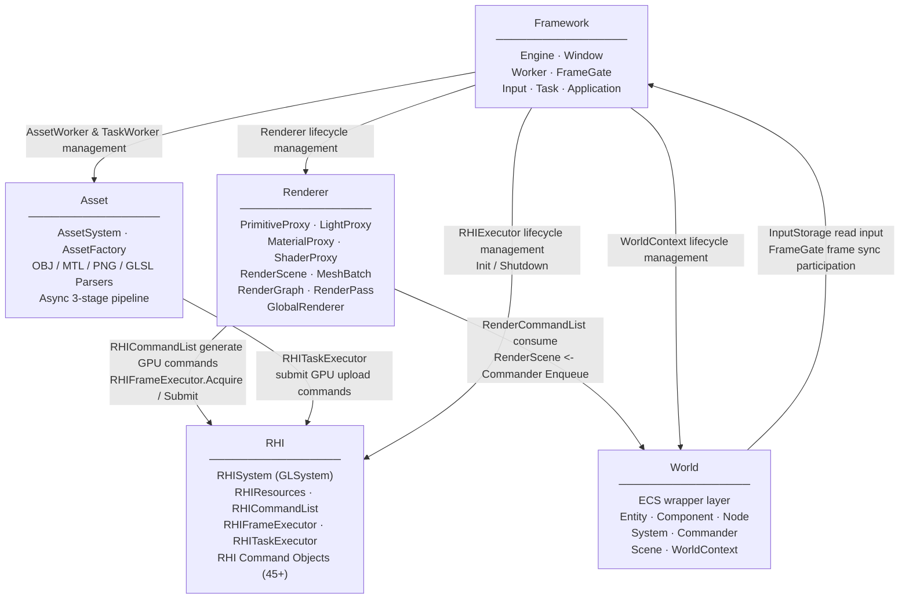

# Architecture Overview

## Core Design Philosophy

* **Unreal Engine Reference** : Implements `PrimitiveProxy`, `RenderScene`, `RHICommandList`, `RenderGraph` patterns reinterpreted in C++17
* **Data-Oriented Design (DOD)** : Component/Node layout designed for cache locality and memory contiguity
* **No STL in Hot Path** : Custom `Vector`, `HashMap`, `HashSet` replace STL in performance-critical paths
* **Multi-threaded Worker Pipeline** : World / Renderer / RHI / Asset each run on independent threads, synchronized via `FrameGate`
* **Runtime Reflection** : `GENERATE`, `PROPERTY`, `METHOD` macros register type information at compile time for runtime access

---

## External Modules (Git Submodules)

| Module | Role |
|--------|------|
| `ECS` | ECS framework: Entity, Component, Node, System, Graph |
| `Memory` | Pool/Array allocators, RefPtr/ObjectPtr/RootPtr smart pointers |
| `Reflection` | C++17 runtime reflection (TypeInfo, PropertyInfo, MethodInfo) |
| `Container` | STL-free Vector, HashMap, HashSet, StaticArray |
| `Log` | Logging system |
| `glm` | Math library (GLM 1.0.1) |
| `glad` | OpenGL 4.5 loader + WGL (Win32) |
| `imgui` | Debug GUI |
| `yaml-cpp` | Configuration file parsing |
| `stb` | Image loader (stb_image) |

---

## Project Structure

```text
Game-Engine/
├── Engine/
│   ├── Public/                  # Public headers
│   │   ├── Framework/           # Engine, Task, TaskWorker, Window, Input
│   │   ├── World/               # World, Entity, Component, Node, System, Commander
│   │   ├── Renderer/            # Renderer, RenderGraph, PipeLine, RenderTypes
│   │   ├── RHI/                 # RHISystem, RHIResources, RHICommandList, RHICommands
│   │   └── Asset/               # AssetSystem, AssetTypes, AssetFactory, Parsers
│   └── Private/                 # Internal implementation
│       ├── Framework/           # Worker, FrameGate
│       ├── World/               # WorldWorker, WorldContext
│       ├── Renderer/            # RenderWorker, RenderScene, RenderCommandList, MeshBatch, Proxy
│       ├── RHI/                 # RHIWorker, RHIFrameExecutor, RHITaskExecutor, OpenGL/
│       └── Asset/               # AssetWorker
├── external/                    # Git Submodules
├── asset/                       # Shaders, textures, model assets
│   └── shader/                  # GLSL shaders (geometry_*.glsl, lighting_*.glsl, transform.cs.glsl)
├── Docs/                        # Design documents
└── CMakeLists.txt
```

---

## 0-A. External Module ↔ Game Engine — Component Dependency

```mermaid
flowchart TD
    subgraph External["External Modules (Git Submodules)"]
        ECS[ECS]
        Memory[Memory]
        Reflection[Reflection]
        Container[Container]
        Log[Log]
        glm[glm]
        glad[glad]
        imgui[imgui]
        yaml-cpp[yaml-cpp]
        stb[stb]
    end

    subgraph Engine["Game Engine"]
        Framework[Framework]
        World[World]
        Renderer[Renderer]
        RHI[RHI]
        Asset[Asset]
    end

    ECS -->|Entity / Component<br>Node / System / Graph| World
    Reflection -->|GENERATE / PROPERTY / METHOD<br>Runtime type registration| World
    glm -->|fvec3 / fmat4 math operations| World
    glm -->|Matrix / vector operations| Renderer
    glm -->|RHIDescriptions math types| RHI
    glad -->|OpenGL 4.5 Core Profile<br>API loading WGL| RHI
    imgui -->|Debug GUI rendering| Framework
    yaml-cpp -->|.yaml config file parsing| Asset
    stb -->|stb_image<br>Image byte decoding| Asset

    Memory -.->|RefPtr / ObjectPtr / RootPtr<br>Pool & Array allocators| Framework
    Memory -.-> World
    Memory -.-> Renderer
    Memory -.-> RHI
    Memory -.-> Asset

    Container -.->|DynamicArray / HashMap<br>HashSet / StaticArray| Framework
    Container -.-> World
    Container -.-> Renderer
    Container -.-> RHI
    Container -.-> Asset

    Log -.->|LOGINFO / LOGERROR macros| Framework
    Log -.-> World
    Log -.-> Renderer
    Log -.-> RHI
    Log -.-> Asset
```



---

## 0-B. Game Engine Internal Modules — Component Dependency

Dependencies always flow **toward lower layers only**.


