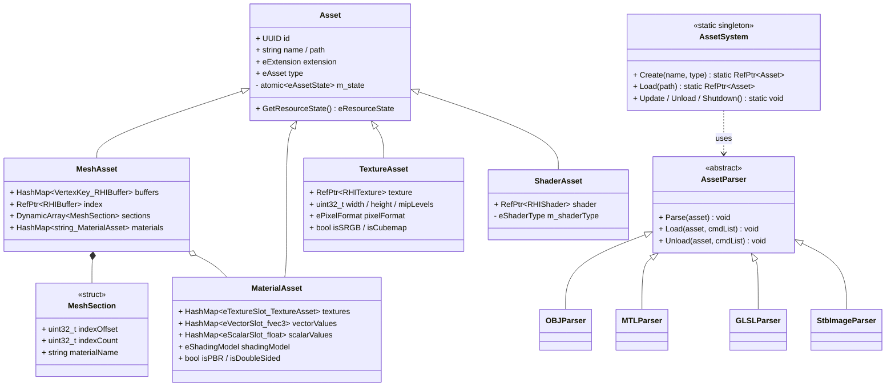

# Asset Pipeline Design

Asset loading is organized as a **3-stage pipeline**: Parse (file read) → Load (GPU format conversion) → Upload (GPU upload).  
Each stage runs in a different thread context, ensuring the main loop is never blocked.

---

## Class Diagram



---

## State Machine

```
eLoaded → eParsed → eReady
  ↑           ↑         ↑
AssetSystem  TaskWorker  RHIWorker
Create()     Parse()     GPU upload
```

`MeshBatch` only references `RHIBuffer` once asset state is `eReady`.

---

## Technical Challenges

### Async 3-Stage Asset Pipeline
- **Problem**: Loading large OBJ/PNG blocks the main loop; GPU uploads must run exclusively in RHI thread context
- **Solution**:
  - **Parse**: `TaskWorker` pool (parallel CPU) — OBJParser reads file, fills `rawBuffers`
  - **Load**: `AssetWorker` — GPU format conversion, enqueues `RHICommandInitializeBuffer`
  - **Upload**: `RHITaskExecutor` — `RHIWorker` executes `glBufferData / glTexImage2D`
  - `atomic<eAssetState>` tracks transitions safely across threads
