# RHI Design

References UE's `FRHICommandList`, `FRHIResource`, `FRHICommandListExecutor`.  
Abstracts the GPU API (OpenGL / DirectX / Vulkan). All GPU commands are encapsulated as **Command Objects** executed serially in RHIWorker.

---

## Class Diagram

```mermaid
classDiagram
    class RHISystem {
        <<abstract>>
        + Init(nativeHandle) bool
        + Clear / Flush / Present / Resize() void
        + SetColorState / DepthState / BlendState / RasterizerState() void
        + CreateBuffer / VertexLayout / Texture / Sampler / Shader / PipeLine() RefPtr
        + InitializeBuffer / UpdateBuffer() void
        + DrawIndexPrimitive / DispatchCompute() void
        + SetRenderTarget / ClearRenderTarget() void
    }

    class GLSystem {
    }
    note for GLSystem "OpenGL 4.5 implementation\nIncludes UInt pixel format support:\neR8_UInt ~ eR32G32B32A32_UInt\nGL_RED_INTEGER / GL_RGBA_INTEGER\nGL_UNSIGNED_INT_SAMPLER_*"

    class RHIBuffer {
        - RHIBufferDesc m_desc
        + GetBufferType() eBufferType
        + GetSize / Stride / Count() uint32_t
    }

    class RHITexture {
        - RHITextureDesc m_desc
        + GetWidth / Height() uint32_t
        + GetPixelFormat() ePixelFormat
    }

    class RHISampler {
        - RHISamplerDesc m_desc
        + GetMinFilter / MagFilter() eFilterMode
    }

    class RHIPipeLine {
        - RHIPipeLineDesc m_desc
        - HashMap~string_RHIResourceBinding~ m_slots
        + HasSlot / GetBindingSlot() void
    }

    class RHICommandList {
        - RefPtr~RHISystem~ m_system
        - DynamicArray~RHICommandBase*~ m_commands
        + Enqueue~T~(...) void
        + ExecuteAll() void
        + Reset() void
    }

    class RHICommandBase {
        + Execute(system) void
    }

    class RHIFrameExecutor {
        - size_t m_recordIndex
        - size_t m_beginIndex
        - atomic~size_t~ m_endIndex
        - DynamicArray~RefPtr_RHICommandList~ m_listPool
        + Acquire() RefPtr~RHICommandList~
        + Submit(cmdList) void
        + Execute() void
    }
    note for RHIFrameExecutor "Triple buffering\nAll indices init to 0\n(phantom-slot data race fix)"

    class RHITaskExecutor {
        + Acquire / Submit / Execute() void
    }
    note for RHITaskExecutor "Asset upload command lists"

    RHISystem <|-- GLSystem
    RHICommandBase <|-- RHICommandT
    RHICommandList o-- RHICommandBase
    RHIExecutor <|-- RHIFrameExecutor
    RHIExecutor <|-- RHITaskExecutor
    RHICommandList ..> RHISystem : delegates to
```



---

## ePixelFormat — UInt Extensions

| Enum | GL Internal Format | GL Base Format | GL Data Type |
|------|--------------------|----------------|--------------|
| `eR8_UInt` | `GL_R8UI` | `GL_RED_INTEGER` | `GL_UNSIGNED_BYTE` |
| `eR8G8_UInt` | `GL_RG8UI` | `GL_RG_INTEGER` | `GL_UNSIGNED_BYTE` |
| `eR8G8B8A8_UInt` | `GL_RGBA8UI` | `GL_RGBA_INTEGER` | `GL_UNSIGNED_BYTE` |
| `eR16_UInt` | `GL_R16UI` | `GL_RED_INTEGER` | `GL_UNSIGNED_SHORT` |
| `eR16G16B16A16_UInt` | `GL_RGBA16UI` | `GL_RGBA_INTEGER` | `GL_UNSIGNED_SHORT` |
| `eR32_UInt` | `GL_R32UI` | `GL_RED_INTEGER` | `GL_UNSIGNED_INT` |
| `eR32G32B32A32_UInt` | `GL_RGBA32UI` | `GL_RGBA_INTEGER` | `GL_UNSIGNED_INT` |

---

## ClearRenderTarget

```
For each color attachment:
  glColorMaski(slot, GL_TRUE, GL_TRUE, GL_TRUE, GL_TRUE)
  UNorm/Float → glClearBufferfv
  UInt         → glClearBufferuiv    ← must use for tGPhong
  SInt         → glClearBufferiv

For depth/stencil:
  glDepthMask(GL_TRUE)               ← CRITICAL: must enable before depth clear
  glStencilMask(0xFF)
  glClearBufferfi(GL_DEPTH_STENCIL, 0, depth, stencil)
```

---

## Technical Challenges

### RHI Command Object Pattern
- **Problem**: OpenGL APIs have `GLContext` thread affinity — calling from render thread causes undefined behavior
- **Solution**: All GPU commands encapsulated as `RHICommandBase`-derived objects (45+). Only RHIWorker calls `ExecuteAll()`. `RHIFrameExecutor` triple-buffers command lists to prevent CPU-GPU stalls.

### RHIFrameExecutor Phantom Slot Data Race
- **Problem**: `beginIndex` initialized to 2 (ring buffer offset), causing RHIWorker to read an uninitialized command list slot on frame 0
- **Solution**: All indices (`recordIndex`, `beginIndex`, `endIndex`) initialized to 0
