# Renderer / Lighting Design

## Render Pipeline Overview

```
TransformPass (GPU Compute TRS)
    → GeometryPass (GBuffer fill)
        → LightingPass × N lights (deferred shading)
```

`RenderPass` is split into `ComputePass` (compute shader dispatch) and `GraphicPass` (indexed draw) abstract bases.  
`GlobalRenderer` consolidates `GlobalResource`, `GlobalPipeLine`, and `GlobalSampler` into a single facade.

---

## GBuffer Layout

| Slot | Name | Format | Contents |
|------|------|--------|----------|
| Depth | `tGDepth` | `D24_S8` | Scene depth + stencil |
| Color 0 | `tGNormal` | `R16G16B16A16_UNorm` | World-space normal (encoded: `N * 0.5 + 0.5`) |
| Color 1 | `tGAlbedo` | `R8G8B8A8_UNorm` | Diffuse RGB + Opacity (A) |
| Color 2 | `tGPhong` | `R16G16B16A16_UInt` | Specular + Emissive bit-packed + Shininess |

### tGPhong Bit Packing

Each of R/G/B channels holds two 8-bit values. A channel holds shininess as a uint.

```
Channel layout (per R, G, B):
  bits [7:0]   = specular component × 255
  bits [15:8]  = emissive component × 255

Channel A:
  bits [15:0]  = shininess (uint)
```

**Geometry shader encoding:**
```glsl
layout(location = 2) out uvec4 tGPhong;

tGPhong = uvec4(
    uint(specular.r * 255.0) | (uint(emissive.r * 255.0) << 8u),
    uint(specular.g * 255.0) | (uint(emissive.g * 255.0) << 8u),
    uint(specular.b * 255.0) | (uint(emissive.b * 255.0) << 8u),
    uint(shininess)
);
```

**Lighting shader decoding:**
```glsl
layout(binding = 3) uniform usampler2D tGPhong;
uvec4 phong = texture(tGPhong, uv);

vec3 specular = vec3(
    float(phong.r & 0xFF) / 255.0,
    float(phong.g & 0xFF) / 255.0,
    float(phong.b & 0xFF) / 255.0
);
vec3 emissive = vec3(
    float((phong.r >> 8u) & 0xFF) / 255.0,
    float((phong.g >> 8u) & 0xFF) / 255.0,
    float((phong.b >> 8u) & 0xFF) / 255.0
);
float shininess = float(phong.a);
```

> **Why UInt texture?**  
> UNorm textures clamp values to [0, 1]. Bit-packed values (e.g., `spec | (emis << 8u)`) exceed 255 and require integer storage.  
> UInt textures must use `usampler2D`, `GL_NEAREST` filtering only, and `glClearBufferuiv` for clearing.

---

## Lighting Pass Design

Each light is processed as a **separate DrawCall** (screen-space quad) with **additive blending** (`GL_ONE, GL_ONE`).  
Directional light includes ambient; Point/Spot passes do not.

### Phong Lighting Formula

```
FragColor = ambient + Σ_lights [ (diffuse × NdotL + specular × RdotV^shininess) × lightColor × intensity × attenuation ]
          + emissive
```

| Term | Description |
|------|-------------|
| `NdotL` | `dot(N, -incidentDir)` — surface facing toward light |
| `RdotV` | `dot(reflect(incidentDir, N), viewDir)` — reflection toward camera |
| `attenuation` | 1.0 for directional; distance-based falloff for point/spot |

---

## Directional Light Pass

```glsl
vec3 lightDir = normalize(-light.direction);  // toward light
float NdotL   = max(dot(normal, lightDir), 0.0);

vec3 reflection = reflect(-lightDir, normal);  // lightDir = toward light → -lightDir = incident
float RdotV = max(dot(reflection, viewDir), 0.0);

vec3 lightOut = (diffuse * NdotL + specular * pow(RdotV, shininess)) * light.color * light.intensity;
lightOut += emissive;
vec3 ambient = diffuse * 0.03;
FragColor = vec4(ambient + lightOut, opacity);
```

---

## Point Light Pass

### World Position Reconstruction

```glsl
vec3 GetWorldPosition(vec2 uv) {
    float depth = texture(tGDepth, uv).r;
    vec4 ndcPos = vec4(uv * 2.0 - 1.0, depth * 2.0 - 1.0, 1.0);
    vec4 viewPos = camera.invProj * ndcPos;
    viewPos /= viewPos.w;
    return (camera.invView * viewPos).xyz;
}
```

### Attenuation

```glsl
float lightDist   = length(light.position - position);
float distRatio   = lightDist / max(light.range, 0.0001);
float falloff     = clamp(1.0 - distRatio * distRatio, 0.0, 1.0);
float attenuation = falloff / (lightDist * lightDist + 1.0);
```

- `1 / r²` alone diverges as r → 0 → `+ 1.0` prevents blow-up
- `falloff`: smooth cutoff at `light.range` boundary

### Two-sided Lighting (incidentDir Correction)

When a point light is **inside a mesh**, face normals point outward (away from the light), causing `NdotL < 0`.  
Instead of `abs(NdotL)` (which corrupts specular), the incident direction is corrected:

```glsl
vec3 lightToFrag = normalize(position - light.position);  // raw incident direction

// If lightToFrag and normal point the same way (back face), reflect lightToFrag to the other side
vec3 incidentDir = lightToFrag - 2.0 * max(dot(normal, lightToFrag), 0.0) * normal;

float NdotL  = dot(normal, -incidentDir);               // always >= 0
vec3 refDir  = reflect(incidentDir, normal);            // correct geometric reflection
float RdotV  = max(dot(refDir, viewDir), 0.0);
```

**Why not `abs(NdotL)`?**  
`abs(NdotL)` fixes diffuse but leaves `reflect(-lightDir, normal)` computing the wrong direction for back faces — incident direction points away from the surface, so reflection points into the surface. Specular becomes 0 or incorrect.

**Why not `faceforward` on normal?**  
`reflect(I, N) == reflect(I, -N)` — flipping the normal does not change the reflection vector. `faceforward` only fixes `NdotL`, not specular.

**`incidentDir` trick:**  
Branchless conditional reflect. If `dot(normal, lightToFrag) > 0` (back face), reflects `lightToFrag` to the front side. Otherwise passes through unchanged.  
Equivalent to: `dot(normal, lightToFrag) > 0 ? reflect(lightToFrag, normal) : lightToFrag`.

```glsl
vec3 lightOut = (diffuse * NdotL + specular * pow(RdotV, shininess))
              * light.color * light.intensity * attenuation;
lightOut += emissive;
FragColor = vec4(lightOut, opacity);  // no ambient in point pass
```

---

## UInt Texture Support (GLSystem)

`tGPhong` uses `R16G16B16A16_UInt` format. Key differences from UNorm:

| Operation | UNorm | UInt |
|-----------|-------|------|
| GLSL sampler | `sampler2D` | `usampler2D` |
| Filtering | bilinear OK | `GL_NEAREST` only |
| Clear | `glClearColor + glClear` | `glClearBufferuiv` |
| Internal format | `GL_RGBA16` | `GL_RGBA16UI` |
| Base format | `GL_RGBA` | `GL_RGBA_INTEGER` |
| Data type | `GL_UNSIGNED_SHORT` | `GL_UNSIGNED_SHORT` |

`GLSystem` was extended with `eR8_UInt` through `eR32G32B32A32_UInt` enum values and corresponding `GetInternalFormat`, `GetFormat`, `GetDataType`, and `IsSampler` (GL_UNSIGNED_INT_SAMPLER_*) overrides.

---

## Renderer Class Diagram

```mermaid
classDiagram
    class Renderer {
        - RefPtr~RenderScene~ m_refScene
        - RefPtr~RenderGraph~ m_refGraph
        - RefPtr~RenderCommandList~ m_refCommandList
        - DynamicArray~RenderView~ m_renderViews
        + Init() bool
        + Execute(cmdList) void
        + PreDraw / Draw / PostDraw(cmdList) void
    }

    class RenderScene {
        - HashMap~UUID_RefPtr_PrimitiveProxy~ m_primitives
        - HashMap~UUID_RefPtr_LightProxy~ m_lights
        - HashMap~MeshBatchKey_RefPtr_MeshBatch~ m_meshBatches
        + Flush(cmdList) void
        + AddPrimitive / RemovePrimitive() void
        + AddLight / RemoveLight() void
    }

    class RenderGraph {
        - DynamicArray~RefPtr_RenderPass~ m_passes
        + Execute(cmdList, renderScene, renderView) void
    }

    class RenderPass {
        <<abstract>>
        + Draw(drawCommands, lightProxies, cmdList) bool
        + Upload / Unload(cmdList) void
    }

    class ComputePass {
        <<abstract>>
        # RefPtr~ShaderState~ m_computeShader
    }

    class GraphicPass {
        <<abstract>>
        # RHIClearState / ColorState / DepthState / BlendState / RasterizerState
    }

    class TransformPass {
    }
    note for TransformPass "GPU compute TRS → mat4\nlocal_size_x=64 per instance"

    class CullingPass {
    }
    note for CullingPass "STUB — pass-through, not implemented"

    class GeometryPass {
    }
    note for GeometryPass "Fills GBuffer: Normal / Albedo / Phong / Depth"

    class LightingPass {
    }
    note for LightingPass "Screen-quad draw per light\nAdditive blending (GL_ONE, GL_ONE)"

    class LightProxy {
        <<abstract>>
        - RefPtr~RHIBuffer~ m_lightBuffer
        - RefPtr~RHITexture~ m_shadowMap
    }

    class DirectionalLightProxy {
        + GetViewMatrix() fmat4
        + GetProjectionMatrix() fmat4
    }

    class PointLightProxy {
        + SetRange(range) void
    }

    class SpotLightProxy {
        + SetRange / SetInnerAngle / SetOuterAngle() void
    }

    class MeshBatch {
        - HashMap~UUID_TransformInfo~ m_transformInfos
        - RefPtr~MeshDrawCommand~ m_drawCommand
        + Upload / Sync / Unload(cmdList) void
    }

    class MeshDrawCommand {
        + RefPtr~RHIBuffer~ rawTransform
        + RefPtr~RHIBuffer~ transform
        + RefPtr~RHIVertexLayout~ vertexLayout
        + RefPtr~const_MaterialProxy~ material
    }

    Renderer *-- RenderScene
    Renderer *-- RenderGraph

    RenderGraph *-- RenderPass
    RenderPass <|-- ComputePass
    RenderPass <|-- GraphicPass
    ComputePass <|-- TransformPass
    ComputePass <|-- CullingPass
    GraphicPass <|-- GeometryPass
    GraphicPass <|-- LightingPass

    RenderScene o-- LightProxy
    LightProxy <|-- DirectionalLightProxy
    LightProxy <|-- PointLightProxy
    LightProxy <|-- SpotLightProxy

    RenderScene o-- MeshBatch
    MeshBatch *-- MeshDrawCommand
```



---

## Technical Challenges

### Deferred Rendering — RenderPass Architecture
- **Problem**: Single `PipeLine` abstraction could not express multi-pass or compute dispatch cleanly
- **Solution**: `RenderPass` hierarchy with `ComputePass` and `GraphicPass` bases. Each pass owns its pipeline state (depth, blend, rasterizer, clear)

### GPU Compute TRS — TransformPass
- **Problem**: CPU GLM matrix computation was dominant bottleneck (30k instances < 10 FPS Debug)
- **Solution**: `TransformPass` dispatches `transform.cs.glsl` (`local_size_x=64`). Each invocation reads `RawTransform` (vec3 pos, vec4 quat, vec3 scale) and writes mat4 to SSBO
- **Result**: 500k instances @ 20 FPS Release (×10 improvement)

### GBuffer Phong — UInt Texture
- **Problem**: Bit-packed specular/emissive values exceed 1.0, clamped to max in UNorm textures
- **Solution**: Switched `tGPhong` to `R16G16B16A16_UInt`. Requires `usampler2D`, `GL_NEAREST`, `glClearBufferuiv`

### Point Light — Two-sided Lighting
- **Problem**: Light inside mesh → outward normals → `NdotL < 0` → surface unlit or incorrect specular with `abs()`
- **Solution**: `incidentDir` correction: branchless conditional reflect using `max(dot(normal, lightToFrag), 0.0)`. Guarantees correct incident direction for both diffuse and specular

### ClearRenderTarget — Depth Mask
- **Problem**: `glDepthMask(GL_FALSE)` set by lighting pass persisted into next frame's depth clear → depth never cleared
- **Solution**: `glDepthMask(GL_TRUE)` explicitly called before `glClearBufferfi` in `ClearRenderTarget`
