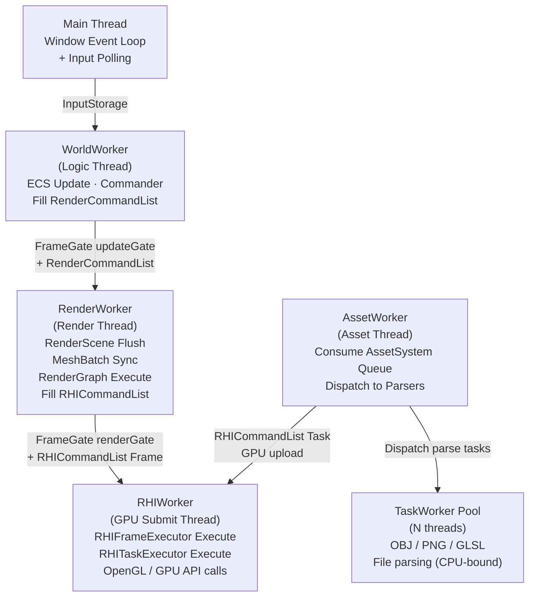
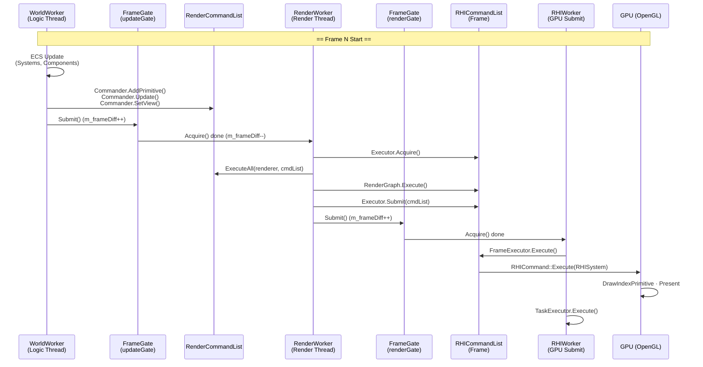
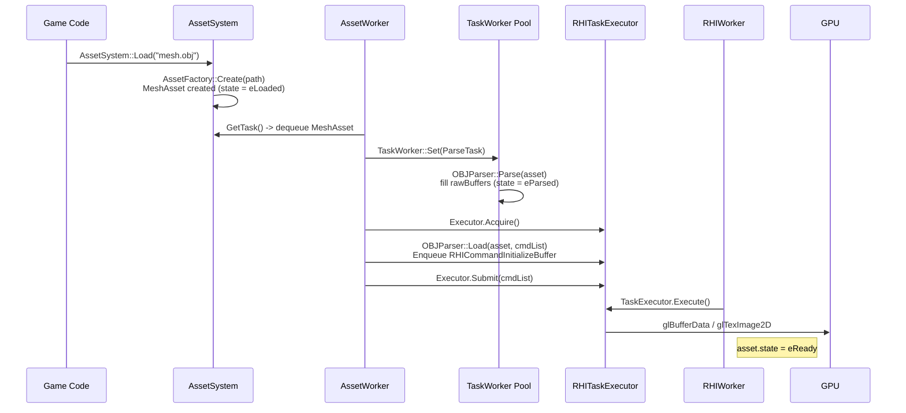
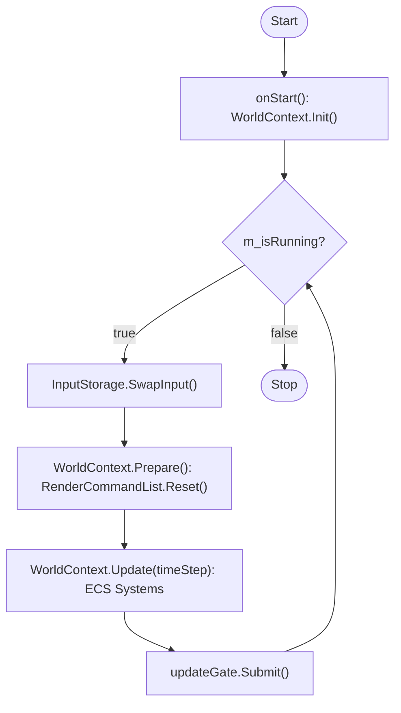
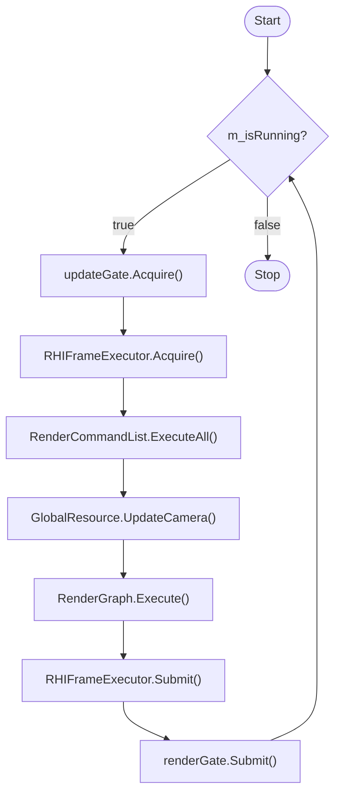
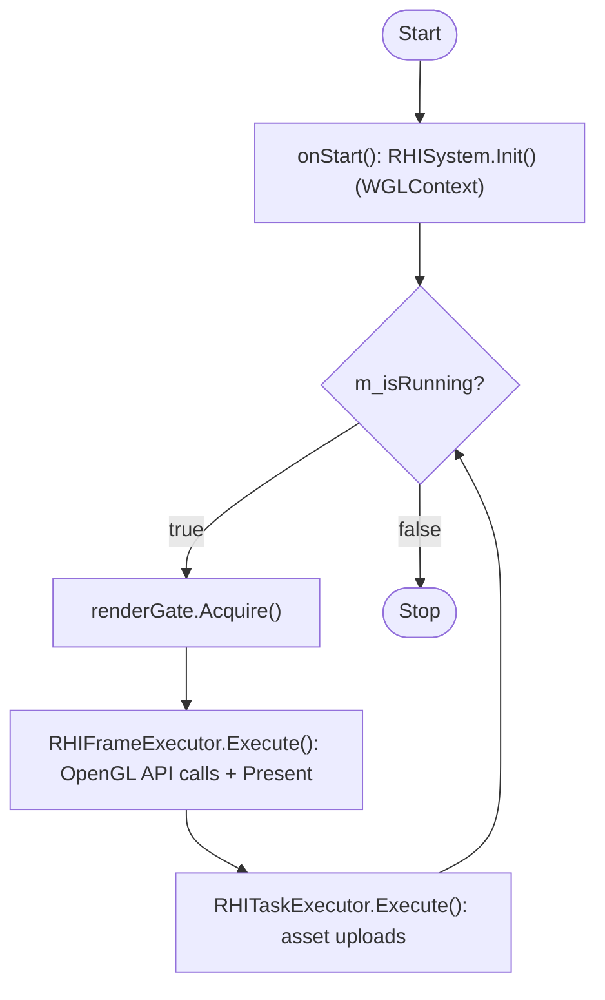
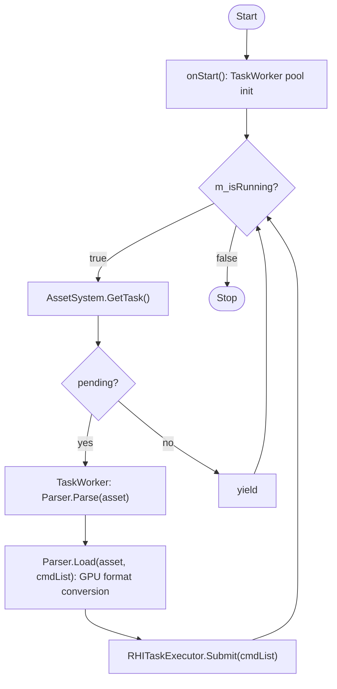

# Threading & Sequences

## Thread Overview

The engine runs 4 independent worker threads plus a task thread pool.

---

## Frame Update Sequence — World → Renderer → RHI

`FrameGate` implements producer-consumer synchronization between World↔Renderer and Renderer↔RHI.

---

## Asset Loading Sequence — Async 3-Stage Pipeline

---

## Synchronization Mechanism Detail

```mermaid
classDiagram
    class FrameGate {
        - condition_variable m_cvProducer
        - condition_variable m_cvConsumer
        - mutex m_mutex
        - const size_t m_frameLimit
        - atomic~int32_t~ m_frameDiff
        + Submit()
        + Acquire()
    }
    note for FrameGate "Submit() {\n  lock(m_mutex)\n  m_frameDiff++\n  m_cvConsumer.notify_one()\n}\n\nAcquire() {\n  lock(m_mutex)\n  m_cvConsumer.wait(\n    [&]{ return m_frameDiff > 0 }\n  )\n  m_frameDiff--\n}"

    class RHIFrameExecutor {
        - RHICommandList[] m_listPool
        - size_t m_recordIndex
        - size_t m_beginIndex
        - atomic m_endIndex
        + Acquire()
        + Submit()
        + Execute()
    }
    note for RHIFrameExecutor "Acquire() -> m_listPool[m_recordIndex]\nSubmit() -> advance m_recordIndex, m_endIndex++\nExecute() -> process m_beginIndex ~ m_endIndex\n\nAll indices init to 0 to avoid phantom-slot data race"

    class RenderCommandList {
        - atomic~RenderTask*~ m_head / m_tail
        - LinearArena m_allocator[2]
        - atomic~size_t~ m_writeIndex
        + Enqueue()
        + ExecuteAll()
    }
    note for RenderCommandList "Ping-pong LinearArena:\nEnqueue: writes to allocator[writeIndex]\nExecuteAll: swaps writeIndex, drains other buffer\n-> Zero-alloc, lock-free producer-consumer"
```

---

## Per-Worker Activity Diagrams

### WorldWorker (Logic Thread)

### RenderWorker (Render Thread)

### RHIWorker (GPU Submit Thread)

### AssetWorker (Asset Thread)

