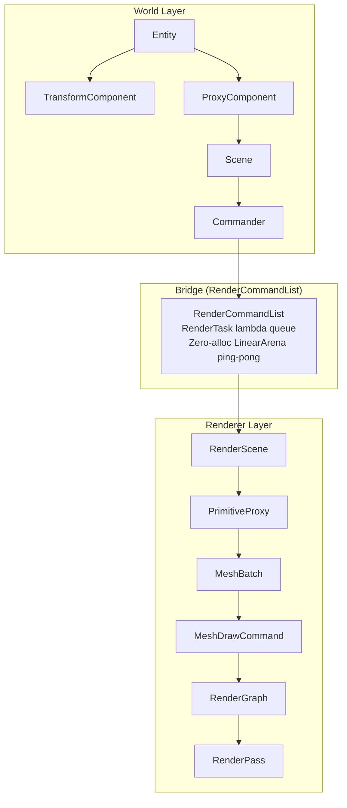

# World / ECS Design

References Unreal Engine's `UWorld`, `AActor`, `UActorComponent` structure.  
`Entity` acts as Actor, `Component` holds data, `Node` handles composition.  
`Commander` is the one-way data bridge from World → Renderer.

Components are split into **data components** (`TransformComponent`, `CameraComponent`) and **proxy components** (`ProxyComponent` subclasses) that notify `Scene` on change.

---

## Class Diagram

```mermaid
classDiagram
    class WorldContext {
        + RootPtr~World~ world
        + RefPtr~Commander~ commander
        + Init() bool
        + Update(timeStep) void
    }

    class World {
        + Scene scene
        + CreateEntity() ObjectPtr~Entity~
        + CreateComponent~T~() ObjectPtr~T~
        + CreateNode~T~() ObjectPtr~T~
        + CreateSystem~T~() RefPtr~T~
    }

    class Entity {
        + AddComponent~T~() bool
        + AddNode~T~() bool
        + GetComponent~T~() ObjectPtr~T~
        + GetNode~T~() ObjectPtr~T~
    }

    class Scene {
        - RefPtr~Commander~ m_refCommander
        - HashMap~UUID_ProxyNode~ m_proxies
        + Flush() void
        + Attach / Detach / Update() void
    }

    class Commander {
        + Enqueue(renderTask) void
        + SetView(renderView) void
        + RemoveAll() void
    }

    class ProxyComponent {
        <<abstract>>
        + OnAttached(scene) void
        + OnDetached() void
        + IsDirty() bool
    }

    class TransformComponent {
        + UpdatePosition / Rotation / Scale() void
        + GetTransform() ftransform
    }

    class StaticMeshComponent {
        + SetMeshAsset(asset) void
    }

    class MaterialComponent {
        + UpdateVector / Scalar() void
        + SetShadingModel / BlendMode() void
    }

    class LightComponent {
        + SetColor / Direction / Intensity() void
        + GetLightDesc() LightDesc
    }

    class DirectionalLightComponent
    class PointLightComponent {
        + SetRange(range) void
    }
    class SpotLightComponent {
        + SetRange / InnerAngle / OuterAngle() void
    }

    class StaticMeshNode {
        + ObjectPtr~TransformComponent~ transform
        + ObjectPtr~StaticMeshComponent~ mesh
        + ObjectPtr~MaterialComponent~ material
    }

    class InstancedStaticMeshNode {
        + ObjectPtr~InstancedTransformComponent~ transform
        + ObjectPtr~StaticMeshComponent~ mesh
    }

    class DirectionalLightNode {
        + ObjectPtr~TransformComponent~ transform
        + ObjectPtr~DirectionalLightComponent~ light
    }

    class PointLightNode {
        + ObjectPtr~TransformComponent~ transform
        + ObjectPtr~PointLightComponent~ light
    }

    class SpotLightNode {
        + ObjectPtr~TransformComponent~ transform
        + ObjectPtr~SpotLightComponent~ light
    }

    WorldContext *-- World
    WorldContext *-- Commander
    World *-- Scene
    World o-- Entity

    ProxyComponent <|-- StaticMeshComponent
    ProxyComponent <|-- MaterialComponent
    ProxyComponent <|-- LightComponent
    LightComponent <|-- DirectionalLightComponent
    LightComponent <|-- PointLightComponent
    LightComponent <|-- SpotLightComponent

    StaticMeshNode o-- TransformComponent
    StaticMeshNode o-- StaticMeshComponent
    InstancedStaticMeshNode o-- StaticMeshComponent
    DirectionalLightNode o-- DirectionalLightComponent
    PointLightNode o-- PointLightComponent
    SpotLightNode o-- SpotLightComponent

    Scene ..> Commander : uses
```

---

## World → Renderer Data Flow

---

## Technical Challenges

### PrimitiveProxy Pattern
- **Problem**: Exposing World Entity/Component directly to the renderer creates tight coupling
- **Solution**: References UE's `UPrimitiveComponent → FPrimitiveSceneProxy` pattern. `MeshNode` → `PrimitiveProxy` on attach. Transform changes forwarded via `Commander`. Renderer has zero knowledge of World types.

### Zero-Allocation Render Command Queue
- **Problem**: `new` per RenderTask accumulates heap fragmentation
- **Solution**: `RenderCommandList` uses two `LinearArena` instances ping-pong. Producer writes to one, Consumer drains the other atomically.

### Per-Instance Dirty Tracking Hash Storm
- **Problem**: `InstancedTransformComponent` called `OnUpdate()` on every mutation → 2,000,000 `HashSet::Insert` per frame at 1M instances (World: 15.37%, RenderScene: 20.30% frame time)
- **Solution**: `if (!IsDirty()) OnUpdate()` guard. Proxy inserted into update set exactly once per frame regardless of mutation count.
- **Result**: 1M instances @ ~22 FPS Debug (×4.2, from 5.4 FPS)
