# Custom Game Engine

## Project Overview

This project is a **C++17 Data-Oriented game engine built from scratch**, referencing the architecture of **Unreal Engine**.

The goal is to design and implement the core structures found in commercial engines: **Runtime Reflection**, **Garbage Collection (Mark & Sweep)**, **ECS (Entity Component System)**, and the key rendering pipeline concepts of **MeshBatch**, **PrimitiveProxy**, **RenderGraph**, and **RHI (Render Hardware Interface)**.

Every core layer of the engine is directly controlled — from STL-free custom containers and purpose-built memory allocators to a multi-threaded worker-based pipeline — pursuing a complete understanding of both performance and architecture.

## 📸 Current Progress & Demo

**Milestone: Hash Storm Fix — 1,000,000 Instance Dirty Tracking Optimization (×4.2 Throughput)**
Per-instance `OnUpdate()` dirty-tracking storm eliminated. Previously, each of 1,000,000 `UpdateRotation()` calls unconditionally triggered `OnUpdate()` → `Scene::Update()` → `HashSet::Insert` in the World layer and `RenderScene::m_updatedProxies.Insert()` in the Renderer layer — 2,000,000 hash operations per frame (World: 15.37%, RenderScene: 20.30% of frame time). A single dirty-state guard (`if (!IsDirty()) OnUpdate()`) in `InstancedTransformComponent` and `InstancedStaticPrimitiveProxy` collapsed this to 1 call per frame regardless of instance count.
Result: 1,000,000 instances at **~22 FPS (Release)**. Previous baseline: 1,000,000 instances at 5.4 FPS (185ms/frame).

*[26-05-24] Hash Storm Fix - 1,000,000 Cube in release mode*


---

**Milestone: TransformPass — GPU Compute TRS (×10 Throughput)** TRS matrix computation (position/rotation/scale → mat4) moved from CPU (GLM scalar) to GPU via Compute Shader (`TransformPass`, `local_size_x = 64`).  
The render pipeline is now **TransformPass → GeometryPass → LightingPass**. Result: 100,000 instances at ~20 FPS (Release), 500,000 instances at ~10 FPS (Release). Previous baseline: 30,000 instances fell below 10 FPS in Debug.

*[26-05-24] GPU Compute TRS - 500,000 Cube in the release mode*


---

**Milestone: Deferred Rendering Completed** The full deferred rendering pipeline is operational. GBuffer outputs (Position, Normal, Albedo) are written in the geometry pass and consumed by the lighting pass for per-light shading.

*[26-05-21] Deferred Rendering — full pipeline demo*


*[26-05-21] GBuffer — Albedo / Normal / Position*

| Albedo | Normal | Position |
|:------:|:------:|:--------:|
| 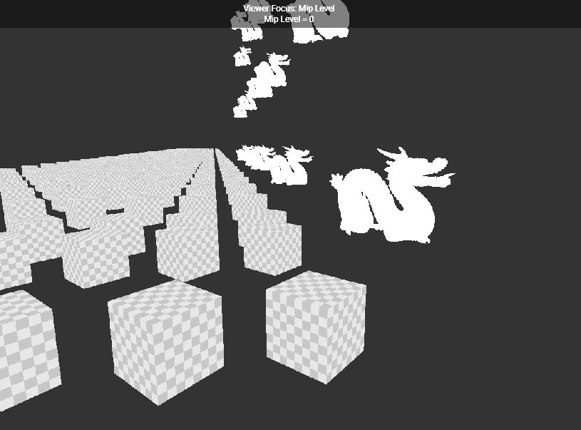 | 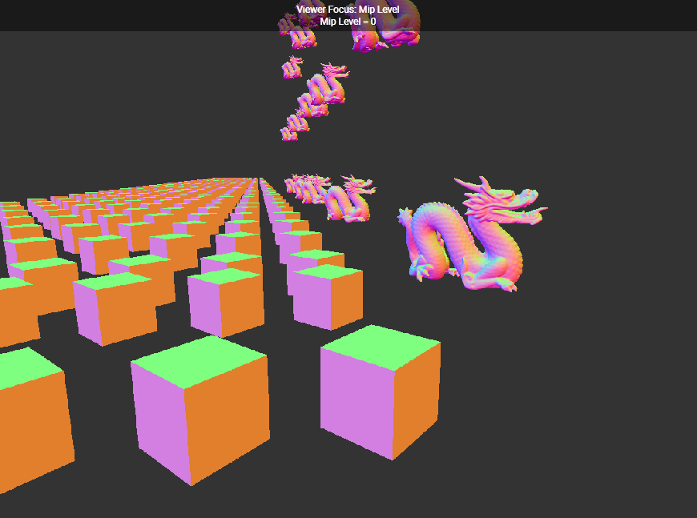 | 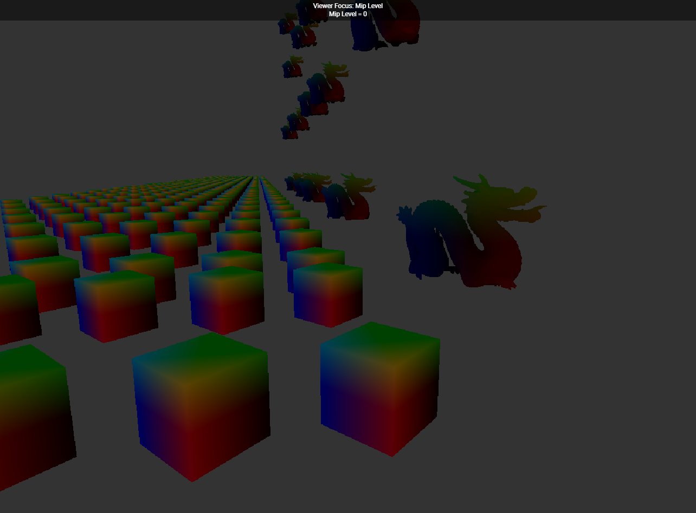 |

---

**Milestone: Core Framework & Basic Rendering Completed** Core backbone, asset parsers, and foundational RHI rendering pipeline.

*[26-04-17] MeshBatch Instancing with Normal Mapping*


*[26-04-18] Base camera system*


---

## Core Design Philosophy

* **Unreal Engine Reference & Reinterpretation** : Implements core rendering concepts from Unreal Engine such as `PrimitiveProxy`, `RenderScene`, `RHICommandList`, and `RenderGraph`
* **Data-Oriented Design (DOD)** : Component/Node layout designed with cache locality and memory contiguity in mind
* **No STL in Hot Path** : Custom `Vector`, `HashMap`, and `HashSet` replace STL in performance-critical paths
* **Multi-threaded Worker Pipeline** : World / Renderer / RHI / Asset each run on independent threads, synchronized via `FrameGate`
* **Runtime Reflection** : `GENERATE`, `PROPERTY`, `METHOD` macros register type information at compile time for runtime access

---

## External Modules (Git Submodules)

| Module | Role |
|--------|------|
| `ECS` | ECS framework based on Entity, Component, Node, System, Graph |
| `Memory` | Pool/Array allocators, RefPtr/ObjectPtr/RootPtr smart pointers |
| `Reflection` | C++17 runtime reflection (TypeInfo, PropertyInfo, MethodInfo) |
| `Container` | STL-free Vector, HashMap, HashSet, StaticArray |
| `Log` | Logging system |
| `glm` | Math library (GLM 1.0.1) |
| `glad` | OpenGL 4.5 loader + WGL (Win32) |
| `imgui` | Debug GUI |
| `yaml-cpp` | Configuration file parsing |
| `stb` | Image loader (stb_image) |

---

## Project Structure

```text
Game-Engine/
├── Engine/
│   ├── Public/                  # Public headers
│   │   ├── Framework/           # Engine, Task, TaskWorker, Window, Input
│   │   ├── World/               # World, Entity, Component, Node, System, Commander
│   │   ├── Renderer/            # Renderer, RenderGraph, PipeLine, RenderTypes
│   │   ├── RHI/                 # RHISystem, RHIResources, RHICommandList, RHICommands
│   │   └── Asset/               # AssetSystem, AssetTypes, AssetFactory, Parsers
│   └── Private/                 # Internal implementation
│       ├── Framework/           # Worker, FrameGate
│       ├── World/               # WorldWorker, WorldContext
│       ├── Renderer/            # RenderWorker, RenderScene, RenderCommandList, MeshBatch, Proxy
│       ├── RHI/                 # RHIWorker, RHIFrameExecutor, RHITaskExecutor, OpenGL/
│       └── Asset/               # AssetWorker
├── external/                    # Git Submodules
├── asset/                       # Shaders, textures, model assets
└── CMakeLists.txt
```

---

## Architecture Diagrams

### 0-A. External Module ↔ Game Engine — Component Dependency

Dependency relationships between external submodules and internal engine modules. `Memory`, `Container`, and `Log` are shared across all layers. `ECS` serves as the foundation framework for the World layer.

```mermaid
flowchart TD
    subgraph External["External Modules (Git Submodules)"]
        ECS[ECS]
        Memory[Memory]
        Reflection[Reflection]
        Container[Container]
        Log[Log]
        glm[glm]
        glad[glad]
        imgui[imgui]
        yaml-cpp[yaml-cpp]
        stb[stb]
    end

    subgraph Engine["Game Engine"]
        Framework[Framework]
        World[World]
        Renderer[Renderer]
        RHI[RHI]
        Asset[Asset]
    end

    ECS -->|Entity / Component<br>Node / System / Graph| World
    Reflection -->|GENERATE / PROPERTY / METHOD<br>Runtime type registration| World
    glm -->|fvec3 / fmat4 math operations| World
    glm -->|Matrix / vector operations| Renderer
    glm -->|RHIDescriptions math types| RHI
    glad -->|OpenGL 4.5 Core Profile<br>API loading WGL| RHI
    imgui -->|Debug GUI rendering| Framework
    yaml-cpp -->|.yaml config file parsing| Asset
    stb -->|stb_image<br>Image byte decoding| Asset

    Memory -.->|RefPtr / ObjectPtr / RootPtr<br>Pool & Array allocators| Framework
    Memory -.-> World
    Memory -.-> Renderer
    Memory -.-> RHI
    Memory -.-> Asset

    Container -.->|DynamicArray / HashMap<br>HashSet / StaticArray| Framework
    Container -.-> World
    Container -.-> Renderer
    Container -.-> RHI
    Container -.-> Asset

    Log -.->|LOGINFO / LOGERROR macros| Framework
    Log -.-> World
    Log -.-> Renderer
    Log -.-> RHI
    Log -.-> Asset
```

---

### 0-B. Game Engine Internal Modules — Component Dependency

Dependency directions and responsibilities of the five internal engine modules. Dependencies always flow **toward lower layers only**.

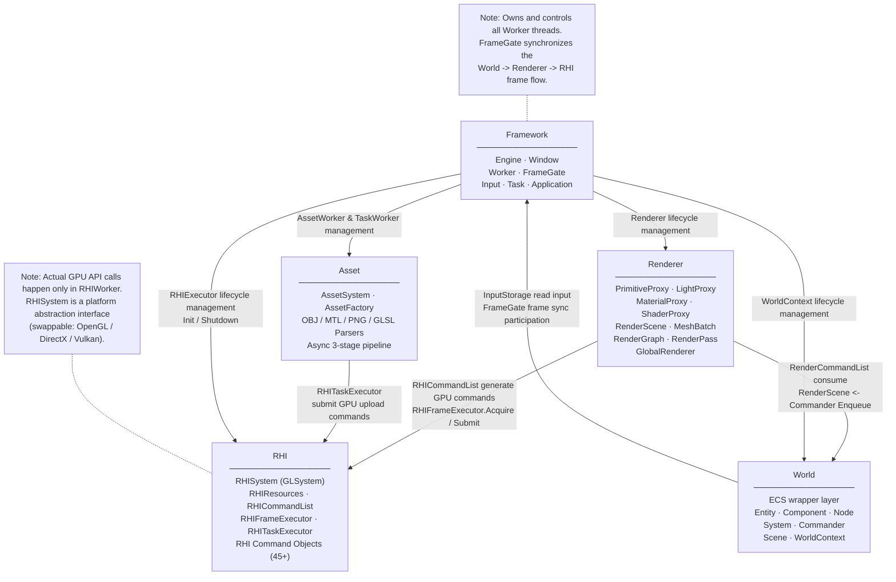

---

### 1. Engine — Full System Composition

The `Engine` class owns and initializes all workers (threads) and subsystems. `FrameGate` synchronizes the frame flow in World → Renderer → RHI order.

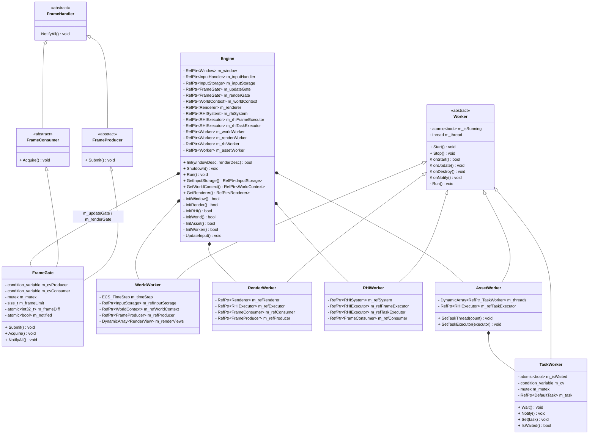

---

### 2. World — ECS Game Logic Layer

References Unreal Engine's `UWorld`, `AActor`, `UActorComponent` structure. `Entity` acts as the `Actor`, `Component` holds data, and `Node` handles component composition. `Commander` is the one-way data bridge from World → Renderer. Components are split into **data components** (`TransformComponent`, `CameraComponent`) and **proxy components** (`ProxyComponent` subclasses) that notify `Scene` on change. Nodes are specialized: `StaticMeshNode`, `InstancedStaticMeshNode`, `DynamicMeshNode`, `CameraNode`, and three light node types.

```mermaid
classDiagram
    class WorldContext {
        + RootPtr~World~ world
        + RefPtr~ViewController~ views
        + RefPtr~PlayerController~ players
        + RefPtr~Commander~ commander
        + Init() bool
        + Clear() void
        + Prepare() void
        + Update(timeStep) void
    }

    class World {
        <<ECS::Object>>
        + Scene scene
        + Init(commander) bool
        + Update(timeStep) void
        + CreateEntity() ObjectPtr~Entity~
        + CreateComponent~T~(...) ObjectPtr~T~
        + CreateNode~T~(...) ObjectPtr~T~
        + CreateSystem~T~(...) RefPtr~T~
        + GetEntity(uuid) ObjectPtr~Entity~
        + RemoveEntity(uuid) void
    }

    class Entity {
        <<ECS::Entity>>
        - World* m_owner
        + Clear() void
        + AddComponent~T~(...) bool
        + AddNode~T~(...) bool
        + GetComponent~T~() ObjectPtr~T~
        + GetNode~T~() ObjectPtr~T~
        + HasAllComponents~TList~() bool
    }

    class Scene {
        - RefPtr~Commander~ m_refCommander
        - HashMap~UUID_ProxyNode~ m_proxies
        - HashSet~added_removed_updated~
        + SetCommander(commander) void
        + Flush() void
        + Attach(proxyNode) void
        + Detach(proxyNode) void
        + Detach(uuid) void
        + DetachAll() void
        + Update(uuid) void
    }

    class Commander {
        - RefPtr~RenderCommandList~ m_refCmdList
        + SetCommand(cmdList) void
        + SetView(renderView) void
        + Enqueue(renderTask) void
        + RemoveAll() void
    }

    class BaseComponent {
        <<ECS::Component>>
    }

    class TransformComponent {
        - ftransform m_transform
        + UpdatePosition(pos) void
        + UpdateRotation(rot) void
        + UpdateScale(scale) void
        + GetPosition() fvec3
        + GetRotation() fvec3
        + GetScale() fvec3
        + GetTransform() ftransform
    }

    class ProxyComponent {
        <<abstract>>
        + OnAttached(scene) void
        + OnDetached() void
        + ClearDirty() void
        + IsDirty() bool
    }

    class CameraComponent {
        + float nearPlane
        + float farPlane
        + float fovY
        + float width
        + float height
        + bool perspective
    }

    class InstancedTransformComponent {
        - DynamicArray~ftransform~ m_instanceTransforms
        + AddInstance(transform) void
        + RemoveInstance(index) void
        + GetInstanceCount() size_t
    }

    class StaticMeshComponent {
        + SetMeshAsset(meshAsset) void
        + GetMeshAsset() RefPtr~MeshAsset~
        + IsChanged() bool
        + ClearChanged() void
    }

    class DynamicMeshComponent {
        + UpdateVertex(key, buffer) void
        + UpdateIndex(buffer) void
        + UpdateSection(sections) void
        + UpdateDrawMode(mode) void
    }

    class MaterialComponent {
        + UpdateVector(slot, value) void
        + UpdateScalar(slot, value) void
        + SetShadingModel(model) void
        + SetBlendMode(mode) void
        + SetDoubleSide(flag) void
        + SetPBR(flag) void
    }

    class LightComponent {
        + SetLightType(type) void
        + SetColor(color) void
        + SetDirection(dir) void
        + SetIntensity(intensity) void
        + GetLightDesc() LightDesc
    }

    class DirectionalLightComponent {
    }

    class PointLightComponent {
        + SetRange(range) void
        + GetRange() float
    }

    class SpotLightComponent {
        + SetRange(range) void
        + SetInnerAngle(angle) void
        + SetOuterAngle(angle) void
    }

    class BaseNode {
        <<ECS::Node>>
    }

    class CameraNode {
        + ObjectPtr~TransformComponent~ transform
        + ObjectPtr~CameraComponent~ camera
        + GetViewMatrix() fmat4
        + GetProjectionMatrix() fmat4
    }

    class StaticMeshNode {
        + ObjectPtr~TransformComponent~ transform
        + ObjectPtr~StaticMeshComponent~ mesh
        + ObjectPtr~MaterialComponent~ overrideMaterial
    }

    class InstancedStaticMeshNode {
        + ObjectPtr~InstancedTransformComponent~ transform
        + ObjectPtr~StaticMeshComponent~ mesh
        + ObjectPtr~MaterialComponent~ overrideMaterial
    }

    class DynamicMeshNode {
        + ObjectPtr~TransformComponent~ transform
        + ObjectPtr~DynamicMeshComponent~ mesh
        + ObjectPtr~MaterialComponent~ overrideMaterial
    }

    class DirectionalLightNode {
        + ObjectPtr~TransformComponent~ transform
        + ObjectPtr~DirectionalLightComponent~ light
    }

    class PointLightNode {
        + ObjectPtr~TransformComponent~ transform
        + ObjectPtr~PointLightComponent~ light
    }

    class SpotLightNode {
        + ObjectPtr~TransformComponent~ transform
        + ObjectPtr~SpotLightComponent~ light
    }

    class BaseSystem {
        <<ECS::System>>
    }

    class TypedSystem~T~ {
        # UpdateInternal(timeStep, container) void
        + GetNodeType() TypeInfo
    }

    class InputSystem~T~ {
        # RefPtr~InputStorage~ inputStorage
        + SetInputStorage(storage) void
    }

    class CameraSystem {
    }

    class MoveSystem {
    }

    class InstancedMoveSystem {
    }

    WorldContext *-- World
    WorldContext *-- Commander

    World *-- Scene
    World o-- Entity

    Entity ..> World : uses

    BaseComponent <|-- TransformComponent
    BaseComponent <|-- ProxyComponent
    BaseComponent <|-- CameraComponent
    BaseComponent <|-- InstancedTransformComponent
    ProxyComponent <|-- StaticMeshComponent
    ProxyComponent <|-- DynamicMeshComponent
    ProxyComponent <|-- MaterialComponent
    ProxyComponent <|-- LightComponent
    LightComponent <|-- DirectionalLightComponent
    LightComponent <|-- PointLightComponent
    LightComponent <|-- SpotLightComponent

    BaseNode <|-- CameraNode
    BaseNode <|-- StaticMeshNode
    BaseNode <|-- InstancedStaticMeshNode
    BaseNode <|-- DynamicMeshNode
    BaseNode <|-- DirectionalLightNode
    BaseNode <|-- PointLightNode
    BaseNode <|-- SpotLightNode

    StaticMeshNode o-- TransformComponent
    StaticMeshNode o-- StaticMeshComponent
    StaticMeshNode o-- MaterialComponent

    InstancedStaticMeshNode o-- InstancedTransformComponent
    InstancedStaticMeshNode o-- StaticMeshComponent

    DynamicMeshNode o-- TransformComponent
    DynamicMeshNode o-- DynamicMeshComponent

    CameraNode o-- TransformComponent
    CameraNode o-- CameraComponent

    DirectionalLightNode o-- TransformComponent
    DirectionalLightNode o-- DirectionalLightComponent

    PointLightNode o-- TransformComponent
    PointLightNode o-- PointLightComponent

    SpotLightNode o-- TransformComponent
    SpotLightNode o-- SpotLightComponent

    BaseSystem <|-- TypedSystem
    TypedSystem <|-- MoveSystem
    TypedSystem <|-- InstancedMoveSystem
    TypedSystem <|-- InputSystem
    InputSystem <|-- CameraSystem

    Scene ..> Commander : uses
    Commander ..> RenderCommandList : enqueues
```

---

### 3. Renderer — Rendering Abstraction Layer

References Unreal Engine's `FScene`, `FPrimitiveSceneProxy`, `FMeshBatch`, and `FRenderingCompositePassContext`. World objects are never passed directly to the renderer — they are converted into **Proxy** objects. `RenderScene` reorganizes these Proxies into `MeshBatch` instances to implement instancing. The render pipeline is **TransformPass (GPU compute TRS) → GeometryPass (GBuffer fill) → LightingPass (per-light shading)**. `RenderPass` is split into `ComputePass` (compute shader dispatch) and `GraphicPass` (draw-call pipeline) abstract bases.

```mermaid
classDiagram
    class Renderer {
        - RefPtr~RenderScene~ m_refScene
        - RefPtr~RenderGraph~ m_refGraph
        - RefPtr~RenderCommandList~ m_refCommandList
        - DynamicArray~RenderView~ m_renderViews
        + Init() bool
        + Execute(cmdList) void
        + SetView(view) void
        + PreDraw(cmdList) void
        + Draw(cmdList) void
        + PostDraw(cmdList) void
        + GetScene() RefPtr~RenderScene~
        + GetGraph() RefPtr~RenderGraph~
    }

    class RenderScene {
        - HashMap~UUID_RefPtr_PrimitiveProxy~ m_primitives
        - HashMap~UUID_RefPtr_LightProxy~ m_lights
        - HashMap~MeshBatchKey_RefPtr_MeshBatch~ m_meshBatches
        - HashSet~RefPtr_MeshBatch~ m_updatedBatches
        + Flush(cmdList) void
        + UpdateProxy(updateInfo, cmdList) void
        + AddPrimitive(primitive) void
        + RemovePrimitive(id, cmdList) void
        + AddLight(light) void
        + RemoveLight(id) void
        + GetMeshBatch(key) RefPtr~MeshBatch~
    }

    class RenderGraph {
        - DynamicArray~RefPtr_RenderPass~ m_passes
        - DynamicArray~RefPtr_MeshDrawCommand~ m_drawCommands
        + Init(cmdList) bool
        + Execute(cmdList, renderScene, renderView) void
        + Flush(cmdList) void
    }

    class GlobalResource {
        <<namespace>>
        + Init(cmdList) bool
        + Release(cmdList) void
        + Update(cmdList, renderView) void
        + GetCamera() RefPtr~const_RHIBuffer~
        + GetGBuffer(slot) RefPtr~const_RHITexture~
        + GetQuad() RefPtr~const_RHIVertexLayout~
        + GetPipeLine(cmdList, desc) RefPtr~const_RHIPipeLine~
        + GetSampler(cmdList, slot) RefPtr~const_RHISampler~
        + GetDefaultMaterial() RefPtr~const_MaterialProxy~
        + GetDefaultLight() RefPtr~const_LightProxy~
    }
    note for GlobalResource "Static namespace (not a class)\nCamera UBO · GBuffer textures\nDefault material/light proxies"

    class RenderPass {
        <<abstract>>
        + GetResourceState() eResourceState
        + Draw(drawCommands, lightProxies, cmdList) bool
        + Upload(cmdList) void
        + Unload(cmdList) void
        # SetCommand(cmdList, pipeline, drawCommand) bool
        # UnsetCommand(cmdList) void
    }

    class ComputePass {
        <<abstract>>
        # uint32_t m_groupX
        # uint32_t m_groupY
        # uint32_t m_groupZ
        # RefPtr~ShaderState~ m_computeShader
        + GetDispatchCommand(drawCommand) RHIDispatchDesc
        + GetPipeLine(cmdList) RefPtr~const_RHIPipeLine~
    }

    class GraphicPass {
        <<abstract>>
        # RefPtr~RHIClearState~ m_clear
        # RefPtr~RHIColorState~ m_color
        # RefPtr~RHIDepthState~ m_depth
        # RefPtr~RHIStencilState~ m_stencil
        # RefPtr~RHIBlendState~ m_blend
        # RefPtr~RHIRasterizerState~ m_rasterizer
        + InitState() void
        + SetState(cmdList) void
        + GetDrawCommand(drawCommand) RHIDrawIndexDesc
        + GetPipeLine(cmdList, shader) RefPtr~const_RHIPipeLine~
    }

    class TransformPass {
        + GetResourceState() eResourceState
        + Upload(cmdList) void
        + Draw(drawCommands, lightProxies, cmdList) bool
        # SetCommand(cmdList, pipeline, drawCommand) bool
        # GetDispatchCommand(drawCommand) RHIDispatchDesc
    }
    note for TransformPass "GPU compute TRS → mat4\nlocal_size_x=64 per instance\nRawTransform(pos+rot+scale) → mat4"

    class CullingPass {
        + Draw(drawCommands, lightProxies, cmdList) bool
        # GetDispatchCommand(drawCommand) RHIDispatchDesc
    }
    note for CullingPass "STUB — not yet implemented\nGetResourceState() hard-returns eReady\nDraw() is a pass-through no-op\nCompute shader not loaded"

    class GeometryPass {
        + Draw(drawCommands, lightProxies, cmdList) bool
        # SetCommand(cmdList, pipeline, drawCommand) bool
        # GetDrawCommand(drawCommand) RHIDrawIndexDesc
        + GetPipeLine(cmdList, shader) RefPtr~const_RHIPipeLine~
    }
    note for GeometryPass "Fills GBuffer: Position / Normal / Albedo / Depth"

    class LightingPass {
        + Draw(drawCommands, lightProxies, cmdList) bool
        # SetLight(cmdList, pipeline, light) bool
        # GetDrawCommand(drawCommand) RHIDrawIndexDesc
    }
    note for LightingPass "Deferred shading pass\nscreen-quad draw per light"

    class RenderCommandList {
        - atomic~RenderTask*~ m_head
        - atomic~RenderTask*~ m_tail
        - LinearArena m_allocator[2]
        - atomic~size_t~ m_writeIndex
        - size_t m_readIndex
        + Enqueue(func) void
        + ExecuteAll(renderer, cmdList) void
        + Reset() void
    }

    class SceneProxy {
        - fvec3 m_position
        - fvec3 m_rotation
        - fvec3 m_scale
        + UpdatePosition(pos) void
        + UpdateRotation(rot) void
        + UpdateScale(scale) void
        + GetTransform() fmat4
    }

    class PrimitiveProxy {
        <<abstract>>
        + GetRawData() RefPtr~RawData~
        + UpdateBatch(cmdList) void
        + IsUploadable() bool
        + SetMesh(meshAsset) void
        + SetOverrideMaterial(materialAsset) void
        + GetMesh() RefPtr~const_MeshAsset~
        + GetOverrideMaterial() RefPtr~const_MaterialProxy~
    }

    class SinglePrimitiveProxy {
        <<abstract>>
        - ScalarData~ftransform~ m_transform
        + IsSyncable() bool
    }

    class StaticPrimitiveProxy {
        + UpdateBatch(cmdList) void
    }

    class DynamicPrimitiveProxy {
        + UpdateBatch(cmdList) void
        + UpdateMesh(cmdList) void
    }

    class InstancedStaticPrimitiveProxy {
        - DynamicArray~ftransform~ m_transforms
        - ArrayData~ftransform~ m_rawData
        + IsSyncable() bool
        + UpdateBatch(cmdList) void
        + SetInstanceCount(count) void
        + UpdateTransform(index, transform) void
        + GetInstanceCount() size_t
    }

    class MaterialProxy {
        + SetMaterialAsset(asset) void
        + UpdateMaterialDesc(desc) void
        + GetMaterialDesc() MaterialDesc
        + GetVectorBuffer() RefPtr~const_RHIBuffer~
        + GetScalarBuffer() RefPtr~const_RHIBuffer~
        + GetTexture(slot) RefPtr~const_RHITexture~
    }

    class ShaderProxy {
        - HashMap~typeHash_ShaderState~ m_shaders
        + AddShader(state) void
        + GetShader~T~() RefPtr~const_ShaderState~
        + HasShader~T~() bool
    }
    note for ShaderProxy "Holds typed shader asset refs\n(VS, PS, CS, GS, HS) keyed by type hash"

    class LightProxy {
        <<abstract>>
        - LightDesc m_desc
        - RefPtr~RHIBuffer~ m_lightBuffer
        - RefPtr~RHITexture~ m_shadowMap
        - RefPtr~RHIRenderTarget~ m_shadowTarget
        + SetLightType(type) void
        + SetColor/Direction/Intensity() void
        + GetLightBuffer() RefPtr~const_RHIBuffer~
        + GetShadowMap() RefPtr~const_RHITexture~
        + GetResourceState() eResourceState
    }

    class DirectionalLightProxy {
        + GetViewMatrix() fmat4
        + GetProjectionMatrix() fmat4
        + Upload(cmdList) void
        + Sync(cmdList) void
        + IsSyncable() bool
    }

    class PointLightProxy {
        + SetRange(range) void
    }

    class SpotLightProxy {
        + SetRange(range) void
        + SetInnerAngle(angle) void
        + SetOuterAngle(angle) void
    }

    class MeshBatch {
        - HashMap~UUID_TransformInfo~ m_transformInfos
        - RefPtr~MeshDrawCommand~ m_drawCommand
        - RefPtr~const_MeshAsset~ m_refMesh
        - RefPtr~const_MaterialAsset~ m_refMaterial
        - size_t m_sectionIndex
        + Upload(cmdList) void
        + Unload(cmdList) void
        + Sync(cmdList) void
        + AddTransform(id, transform) void
        + UpdateTransform(id, transform) void
        + RemoveTransform(id) void
        + GetInstanceCount() size_t
        + GetDrawCommand() RefPtr~MeshDrawCommand~
    }

    class MeshDrawCommand {
        + RefPtr~RHIBuffer~ rawTransform
        + RefPtr~RHIBuffer~ transform
        + RefPtr~RHIBuffer~ indirect
        + RefPtr~RHIBuffer~ visible
        + RefPtr~RHIBuffer~ localBounding
        + RefPtr~RHIVertexLayout~ vertexLayout
        + RefPtr~const_MaterialProxy~ material
        + size_t instanceCount
        + bool indirectDraw
        + eDrawMode drawMode
    }
    note for MeshDrawCommand "rawTransform: CPU uploads raw TRS per instance\ntransform: GPU-computed mat4 (TransformPass output)"

    class MeshBatchKey {
        + UUID meshId
        + UUID materialId
        + size_t meshSection
        + operator==() bool
    }

    class RenderView {
        <<struct>>
        + Viewport viewport
        + Camera camera
    }
    note for RenderView "Viewport: posX, posY, width, height\nCamera: viewMatrix, projMatrix\n        position, direction"

    Renderer *-- RenderScene
    Renderer *-- RenderGraph
    Renderer *-- RenderCommandList

    RenderGraph *-- RenderPass

    RenderPass <|-- ComputePass
    RenderPass <|-- GraphicPass
    ComputePass <|-- TransformPass
    ComputePass <|-- CullingPass
    GraphicPass <|-- GeometryPass
    GraphicPass <|-- LightingPass

    RenderScene o-- PrimitiveProxy
    RenderScene o-- LightProxy
    RenderScene o-- MeshBatch

    SceneProxy <|-- PrimitiveProxy
    SceneProxy <|-- LightProxy

    PrimitiveProxy <|-- SinglePrimitiveProxy
    PrimitiveProxy <|-- InstancedStaticPrimitiveProxy
    SinglePrimitiveProxy <|-- StaticPrimitiveProxy
    SinglePrimitiveProxy <|-- DynamicPrimitiveProxy

    LightProxy <|-- DirectionalLightProxy
    LightProxy <|-- PointLightProxy
    LightProxy <|-- SpotLightProxy

    PrimitiveProxy *-- MaterialProxy
    MaterialProxy *-- ShaderProxy
    LightProxy *-- ShaderProxy

    MeshBatch *-- MeshDrawCommand
    MeshBatch ..> MeshBatchKey : keyed by
    MeshDrawCommand ..> MaterialProxy : material ref
```

---

### 4. RHI — Render Hardware Interface

References Unreal Engine's `FRHICommandList`, `FRHIResource`, and `FRHICommandListExecutor` patterns. Abstracts the actual GPU API (OpenGL / DirectX / Vulkan), and all GPU commands are encapsulated as **Command Objects** before being executed serially.

```mermaid
classDiagram
    class RHISystem {
        <<abstract>>
        + Init(nativeHandle) bool
        + Clear(state) void
        + Flush() void
        + Present() void
        + Resize(...) void
        + SetColorState(state) void
        + SetDepthState(state) void
        + SetStencilState(state) void
        + SetBlendState(state) void
        + SetRasterizerState(state) void
        + CreateBuffer(desc) RefPtr~RHIBuffer~
        + CreateVertexLayout(desc) RefPtr~RHIVertexLayout~
        + CreateTexture(desc) RefPtr~RHITexture~
        + CreateSampler(desc) RefPtr~RHISampler~
        + CreateVertexShader(desc) RefPtr~RHIShader~
        + CreatePixelShader(desc) RefPtr~RHIShader~
        + CreatePipeLine(desc) RefPtr~RHIPipeLine~
        + InitializeBuffer(info, buffer) void
        + UpdateBuffer(info, buffer) void
        + DrawIndexPrimitive(info) void
        + DispatchCompute(info) void
    }

    class GLSystem {
    }
    note for GLSystem "OpenGL 4.5 implementation"

    class RHIResource {
        - atomic~eResourceState~ m_state
        + GetRawBuffer() void*
        + SetState(eState) void
        + GetState() eResourceState
    }

    class RHIBuffer {
        - RHIBufferDesc m_desc
        + GetBufferType() eBufferType
        + GetAccessType() eDataAccess
        + GetSize() uint32_t
        + GetStride() uint32_t
        + GetCount() uint32_t
    }

    class RHIVertexLayout {
        - RHIVertexLayoutDesc m_desc
        + GetNumAttributes() size_t
    }

    class RHITexture {
        - RHITextureDesc m_desc
        + GetWidth() uint32_t
        + GetHeight() uint32_t
        + GetPixelFormat() ePixelFormat
        + GetTextureType() eTextureType
    }

    class RHISampler {
        - RHISamplerDesc m_desc
        + GetMinFilter() eFilterMode
        + GetMagFilter() eFilterMode
    }

    class RHIShader {
        - RHIShaderDesc m_desc
        + GetShaderType() eShaderType
    }

    class RHIPipeLine {
        - RHIPipeLineDesc m_desc
        - HashMap~string_RHIResourceBinding~ m_slots
        + GetClearState() RHIClearState
        + GetDepthState() RHIDepthState
        + AddSlot(name, binding) void
        + HasSlot(name) bool
        + GetBindingSlot(name) RHIResourceBinding
    }

    class RHICommandList {
        - RefPtr~RHISystem~ m_system
        - DynamicArray~RHICommandBase*~ m_commands
        - size_t m_frame
        + Enqueue~T~(...) void
        + ExecuteAll() void
        + Reset() void
        + SetFrame(frame) void
        + CreateBuffer(info) RefPtr~RHIBuffer~
        + InitializeBuffer(info, buffer) void
        + UpdateBuffer(info, buffer) void
        + DrawIndexPrimitive(info) void
    }

    class RHICommandBase {
        - ExecuteFunc m_func
        + Execute(system) void
    }

    class RHICommandT {
        <<RHICommand~T~>>
        + ExecuteAndDestruct(system, base) static void
    }
    
    note for RHICommandT "45+ command classes:\nRHICommandClear\nRHICommandFlush\nRHICommandPresent\nRHICommandInitializeBuffer\nRHICommandUpdateBuffer\n..."

    class RHIExecutor {
        <<abstract>>
        - RefPtr~RHISystem~ m_system
        + Acquire() RefPtr~RHICommandList~
        + Submit(cmdList) void
        + Execute() void
    }

    class RHIFrameExecutor {
        - size_t m_frameCount
        - size_t m_recordIndex
        - size_t m_beginIndex
        - atomic~size_t~ m_endIndex
        - DynamicArray~RefPtr_RHICommandList~ m_listPool
        + Acquire() RefPtr~RHICommandList~
        + Submit(cmdList) void
        + Execute() void
        + Init(frameCount) bool
    }

    class RHITaskExecutor {
        + Acquire() RefPtr~RHICommandList~
        + Submit(cmdList) void
        + Execute() void
    }
    note for RHITaskExecutor "Command list pool for asset/task uploads"

    RHISystem <|-- GLSystem

    RHIResource <|-- RHIBuffer
    RHIResource <|-- RHIVertexLayout
    RHIResource <|-- RHITexture
    RHIResource <|-- RHISampler
    RHIResource <|-- RHIShader
    RHIResource <|-- RHIPipeLine

    RHICommandBase <|-- RHICommandT

    RHICommandList o-- RHICommandBase

    RHIExecutor <|-- RHIFrameExecutor
    RHIExecutor <|-- RHITaskExecutor

    RHICommandList ..> RHISystem : delegates to
```

---

### 5. Asset — Async Asset Loading System

Asset loading is organized as a 3-stage pipeline: **Parse (file read)** → **Load (GPU format conversion)** → **Upload (GPU upload)**. Each stage runs in a different thread context, ensuring the main loop is never blocked.

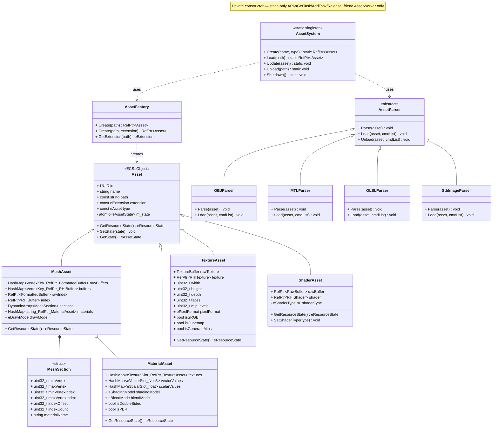

---

## Threading and Data Flow

### Thread Overview

The engine consists of 4 independent worker threads and 1 task thread pool.

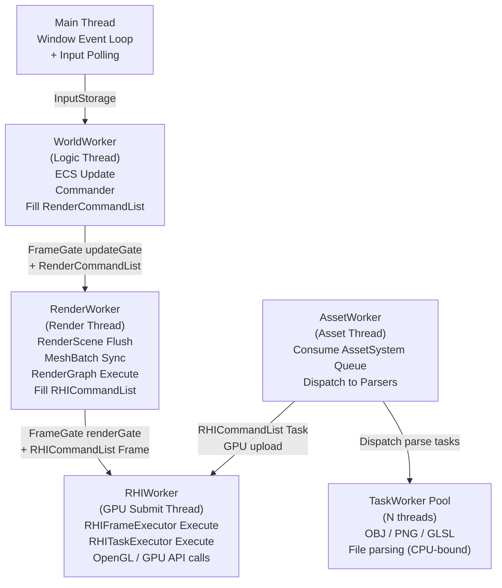

---

### Frame Update Sequence — World → Renderer → RHI

`FrameGate` implements producer-consumer synchronization between World and Renderer, and between Renderer and RHI.

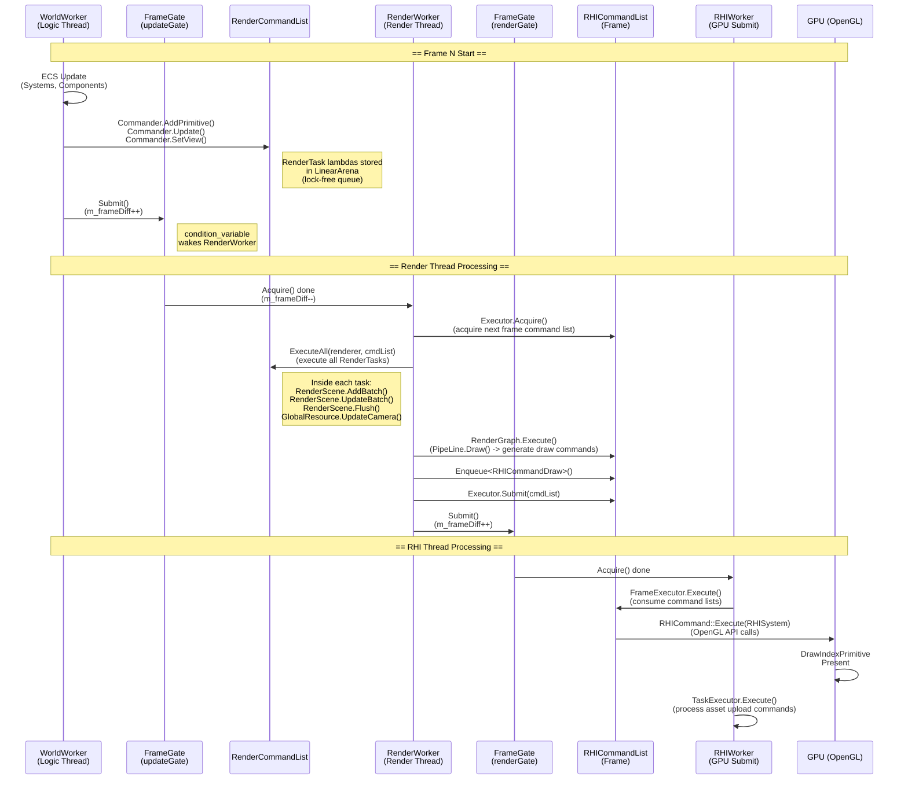

---

### Asset Loading Sequence — Async 3-Stage Pipeline

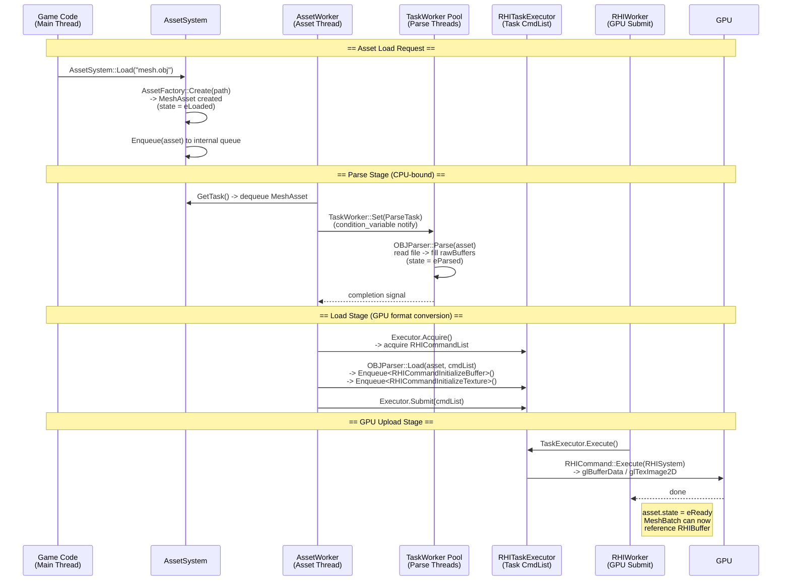

---

### Synchronization Mechanism Detail

```mermaid
classDiagram
    class FrameGate {
        - condition_variable m_cvProducer
        - condition_variable m_cvConsumer
        - mutex m_mutex
        - const size_t m_frameLimit
        - atomic~int32_t~ m_frameDiff
        - atomic~bool~ m_notified
        + Submit()
        + Acquire()
    }
    note for FrameGate "Submit() {\n  lock(m_mutex)\n  m_frameDiff++\n  m_cvConsumer.notify_one()\n}\n\nAcquire() {\n  lock(m_mutex)\n  m_cvConsumer.wait(\n    lock, [&]{ return m_frameDiff > 0 }\n  )\n  m_frameDiff--\n}"

    class RHIFrameExecutor {
        - RHICommandList[] m_listPool
        - size_t m_recordIndex
        - size_t m_beginIndex
        - atomic m_endIndex
        + Acquire()
        + Submit()
        + Execute()
    }
    note for RHIFrameExecutor "m_recordIndex <- written by RenderWorker\nm_beginIndex <- read start index for RHIWorker\nm_endIndex <- cross-thread: Submit writes, Execute reads\n\nAcquire() -> returns m_listPool[m_recordIndex]\nSubmit() -> advances m_recordIndex, increments m_endIndex\nExecute() -> processes range m_beginIndex ~ m_endIndex"

    class RenderCommandList {
        - atomic~RenderTask*~ m_head
        - atomic~RenderTask*~ m_tail
        - LinearArena m_allocator[2]
        - atomic~size_t~ m_writeIndex
        + Enqueue()
        + ExecuteAll()
    }
    note for RenderCommandList "m_allocator <- ping-pong buffers\n\nEnqueue() {\n  task = m_allocator[writeIdx].Alloc()\n  CAS(m_tail, task) <- lock-free insert\n}\nExecuteAll() {\n  m_writeIndex ^= 1 <- swap buffers\n  while(head) head->Execute(); head = head->next\n}"
```

---

### Per-Worker Activity Diagrams

Control flow for each Worker during one frame or one task.

#### WorldWorker (Logic Thread)

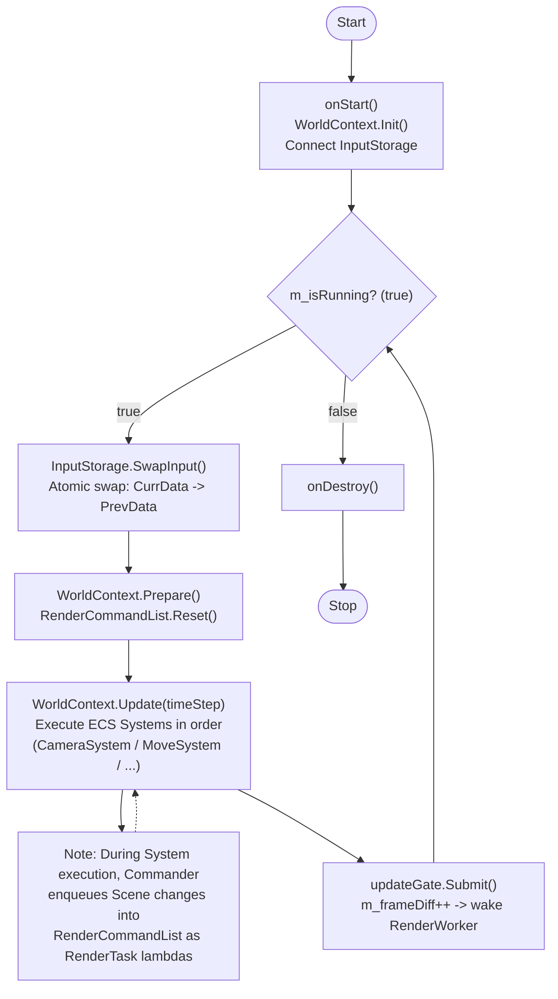

#### RenderWorker (Render Thread)

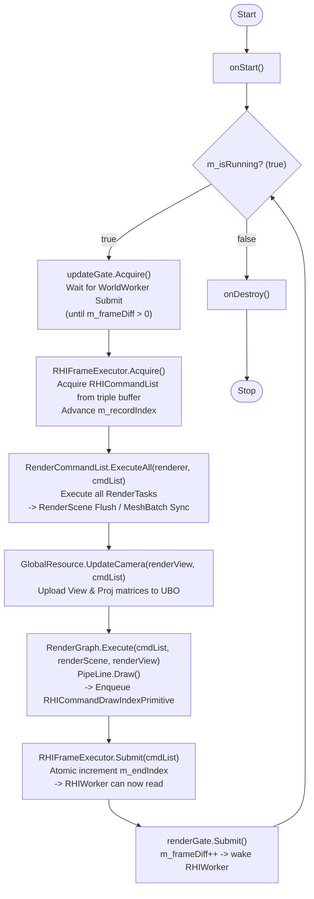

#### RHIWorker (GPU Submit Thread)

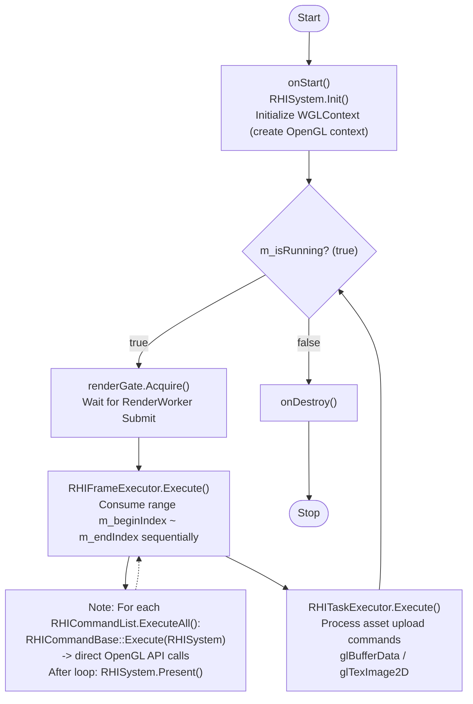

#### AssetWorker (Asset Thread)

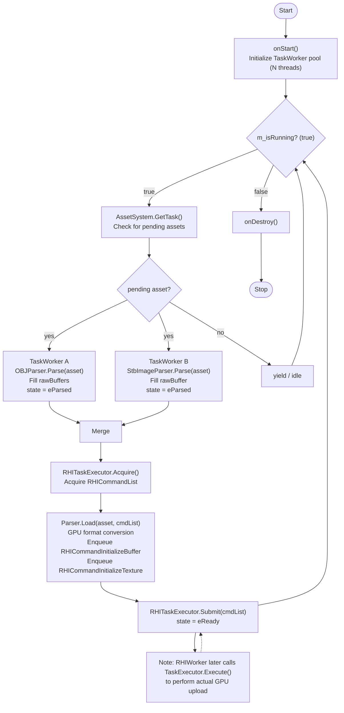

---

## World → Renderer Data Flow Detail

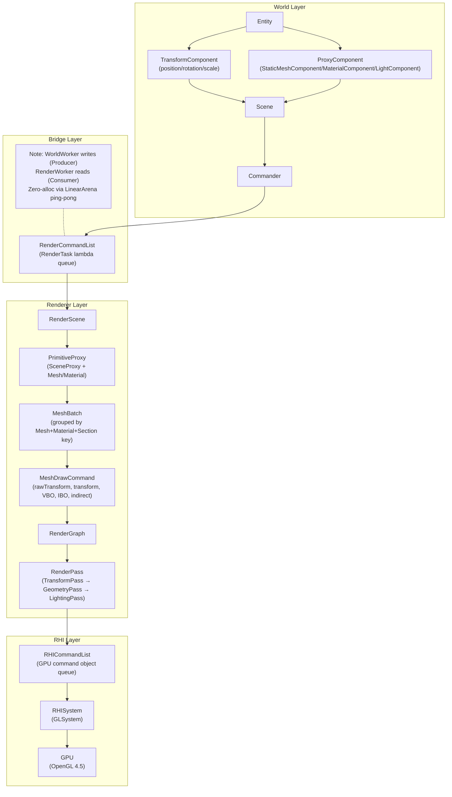

---

## Development Process and Technical Challenges

### 1. Multi-threaded Pipeline Design

* **Problem** : Frame data needed to be transferred between World logic updates and GPU rendering without data races
* **Solution** : Two `FrameGate` instances (updateGate, renderGate) handle World→Renderer and Renderer→RHI synchronization independently. `RenderCommandList` uses a lock-free atomic pointer queue with a ping-pong LinearArena, allowing World thread Enqueue and Render thread ExecuteAll to operate safely without locks

### 2. MeshBatch Instancing

* **Problem** : Submitting dozens to hundreds of objects with the same Mesh + Material combination as individual draw calls causes CPU overhead to spike
* **Solution** : A HashMap keyed by `MeshBatchKey (meshId, materialId, sectionIndex)` is maintained in `RenderScene`. Objects with the same key are grouped into a single `MeshBatch`, and transform data is batch-uploaded to the GPU as an instance buffer (`RHIBuffer`)

### 3. RHI Command Object Pattern

* **Problem** : Calling OpenGL APIs directly from the render thread causes `GLContext` thread affinity issues and makes API abstraction impossible
* **Solution** : All GPU commands are encapsulated as `RHICommandBase`-derived objects (45+). RenderWorker only enqueues command objects into `RHICommandList`, and RHIWorker exclusively calls `ExecuteAll()` to perform actual OpenGL calls. `RHIFrameExecutor` uses triple buffering to prevent CPU-GPU pipeline stalls

### 4. PrimitiveProxy Pattern

* **Problem** : Exposing World Entity/Component directly to the renderer creates tight coupling between World and Renderer, hindering independent evolution of both systems
* **Solution** : References Unreal Engine's `UPrimitiveComponent` → `FPrimitiveSceneProxy` pattern. When a `MeshNode` attaches to the Scene, a `PrimitiveProxy` is created. Transform changes are forwarded to the Renderer via `Commander` as `UpdateProxyInfo`. The Renderer has zero knowledge of World types

### 5. Async 3-Stage Asset Pipeline

* **Problem** : Loading large OBJ/PNG files blocks the main loop, and GPU uploads must run exclusively in the RHI thread context
* **Solution** : Separated into 3 stages: Parse (TaskWorker pool, parallel CPU) → Load (AssetWorker, GPU format conversion) → Upload (RHITaskExecutor, GPU upload). `atomic<eAssetState>` tracks state transitions safely, and MeshBatch only references `RHIBuffer` once asset state is `eReady`

### 6. Deferred Rendering — RenderPass Architecture

* **Problem** : The single `PipeLine` abstraction could not express multi-pass rendering (geometry fill + lighting) or compute dispatch passes cleanly
* **Solution** : Replaced the `PipeLine` system with a `RenderPass` hierarchy: `CullingPass` (GPU compute frustum culling via compute shader), `GeometryPass` (fills GBuffer: Position, Normal, Albedo, Depth into FBO-backed `RHIRenderTarget`), and `LightingPass` (screen-quad draw per light sampling GBuffers). `GlobalRenderer` consolidates the formerly separate `GlobalResource`, `GlobalPipeLine`, and `GlobalSampler` into a single facade. Pipeline state objects (depth, blend, rasterizer, clear) are now owned by each `RenderPass` rather than being global

### 7. GPU Compute TRS — TransformPass

* **Problem** : CPU-side GLM matrix computation (position/rotation/scale → mat4) per instance per frame became the dominant bottleneck at large instance counts (30,000 instances < 10 FPS Debug)
* **Solution** : Added `TransformPass` (a `ComputePass` subclass) that dispatches a GLSL compute shader (`transform.cs.glsl`, `local_size_x = 64`). Each invocation reads one `RawTransform` (vec3 position, vec4 quaternion, vec3 scale) from an SSBO and writes a column-major mat4 to a second SSBO. `MeshDrawCommand` now carries both `rawTransform` (CPU-uploaded TRS) and `transform` (GPU-written mat4). Result: 100,000 instances at ~20 FPS (Debug), 500,000 instances at ~20 FPS (Release) — approximately ×10 throughput improvement
* **RenderPass split** : `RenderPass` base was factored into `ComputePass` (compute shader dispatch path) and `GraphicPass` (indexed draw path) to cleanly separate the two execution models. `CullingPass` is `ComputePass`-derived but temporarily disabled; `GeometryPass` and `LightingPass` are `GraphicPass`-derived

### 8. PrimitiveProxy / LightProxy Type Hierarchy

* **Problem** : The original `PrimitiveProxy` conflated scene-data representation with draw-call generation. A single light proxy type could not express directional/point/spot semantics differently
* **Solution** : `PrimitiveProxy` (abstract base) → `SinglePrimitiveProxy` (one transform per proxy) → `StaticPrimitiveProxy` / `DynamicPrimitiveProxy`; and `InstancedStaticPrimitiveProxy` (multi-transform, `ArrayData<ftransform>` raw data). `LightProxy` (abstract base) → `DirectionalLightProxy` / `PointLightProxy` / `SpotLightProxy`. Each carries its own shadow map, shadow target, and view/projection matrix logic

### 9. Zero-Allocation Render Command Queue

* **Problem** : Allocating RenderTasks with `new` every frame accumulates heap fragmentation and allocation overhead
* **Solution** : `RenderCommandList` runs two `LinearArena` instances in a ping-pong fashion. The write index is atomically swapped so the Producer (World) writes to one buffer while the Consumer (Renderer) drains the other — a Zero-Alloc design

### 10. Per-Instance Dirty Tracking Hash Storm

* **Problem** : `InstancedTransformComponent::AddInstance()` and `InstancedStaticPrimitiveProxy::UpdateTransform()` called `OnUpdate()` unconditionally on every instance mutation. With 1,000,000 instances per frame, this triggered 2,000,000 `HashSet::Insert` operations per frame — one in `Scene::Update()` (World layer, 15.37% of frame time) and one in `RenderScene::m_updatedProxies.Insert()` (Renderer layer, 20.30% of frame time). Frame time: 185 ms (~5.4 FPS Debug)
* **Solution** : Added a dirty-state guard — `OnUpdate()` is only called when the proxy is not already dirty (`if (!IsDirty()) OnUpdate()`). Regardless of how many instances are mutated in one frame, the proxy is inserted into the update set exactly once. The 2,000,000 hash operations per frame collapsed to 1 call
* **Result** : 1,000,000 instances at **~22 FPS (Debug)** — ×4.2 throughput improvement (185 ms → ~45 ms per frame)

---

## Implementation Status

| System | Status |
|--------|--------|
| **Framework** | |
| └ ECS (Entity, Component, Node, System, Graph) | ✅ Complete |
| └ Memory (Pool/Array allocators, RefPtr/ObjectPtr) | ✅ Complete |
| └ Runtime Reflection (TypeInfo, PropertyInfo, MethodInfo) | ✅ Complete |
| └ Container (Vector, HashMap, HashSet) | ✅ Complete |
| └ World / Commander / Scene | ✅ Complete |
| └ GC (Mark & Sweep) full integration | 🚧 In progress |
| └ Serialization (Reflection-based JSON/Binary) | 🚧 Planned |
| **Multi-Threading** | |
| └ Worker System + FrameGate | ✅ Complete |
| **RHI** | |
| └ RHI Layer (OpenGL 4.5, WGL) | ✅ Basic implementation |
| └ RHI Command List | ✅ Complete |
| └ RHI Executor (Triple Buffering, FrameExecutor) | ✅ Complete |
| └ DirectX 11 / 12 RHI backend | 🚧 Planned |
| **Renderer** | |
| └ SceneProxy (PrimitiveProxy, LightProxy) | ✅ Complete |
| └ MaterialProxy / ShaderProxy | ✅ Complete |
| └ MeshBatch Instancing | ✅ Complete |
| └ InstancedPrimitiveProxy (GPU instanced draw) | ✅ Complete (1M instances ~22 FPS Debug, ×4.2 Hash Storm fix) |
| └ RenderGraph / RenderPass (ComputePass / GraphicPass hierarchy) | ✅ Complete |
| └ TransformPass (GPU compute TRS → mat4, 500k instances @ 20 FPS Release) | ✅ Complete |
| └ CullingPass (GPU compute frustum culling) | 🚧 Stub — pass-through, shader not implemented |
| └ GeometryPass (GBuffer fill) | ✅ Complete |
| └ LightingPass (deferred shading) | ✅ Complete |
| └ GlobalRenderer (Camera, GBuffer, Sampler, PipeLine) | ✅ Complete |
| └ Deferred Rendering Pipeline | ✅ Complete |
| └ RenderTarget (FBO-backed render target) | ✅ Complete |
| **Asset** | |
| └ Asset System (OBJ, MTL) | ✅ Complete |
| └ Async Asset loading pipeline | ✅ Complete |
| **Input** | |
| └ Input System | 🚧 In progress (Base complete) |
| **Physics** | |
| └ Physics engine integration | 🚧 Planned |

---

## Build Instructions

### Requirements

* **OS:** Windows 10/11 (64-bit)
* **Compiler:** MSVC (Visual Studio 2019+), C++17
* **Tools:** CMake 3.15+, Git

### Clone and Build

```bash
# Clone with submodules
git clone --recursive [https://github.com/YourUsername/GameEngine.git](https://github.com/YourUsername/GameEngine.git)
cd GameEngine

# If cloned without submodules
git submodule update --init --recursive

# CMake build
mkdir build && cd build
cmake ..
cmake --build . --config Release
```

---

## Tech Stack

| Item | Details |
|------|---------|
| Language | C++17 |
| Graphics API | OpenGL 4.5 Core Profile |
| Windowing | WGL (Win32 API) |
| Math | GLM 1.0.1 |
| Build | CMake 3.15+ |
| Platform | Windows 10/11 |

---

## License

This project is distributed under the MIT License.
