# Custom Game Engine

## Project Overview

This project is a **C++17 Data-Oriented game engine built from scratch**, referencing the architecture of **Unreal Engine**.

The goal is to design and implement the core structures found in commercial engines: **Runtime Reflection**, **Garbage Collection (Mark & Sweep)**, **ECS (Entity Component System)**, and the key rendering pipeline concepts of **MeshBatch**, **PrimitiveProxy**, **RenderGraph**, and **RHI (Render Hardware Interface)**.

Every core layer of the engine is directly controlled — from STL-free custom containers and purpose-built memory allocators to a multi-threaded worker-based pipeline — pursuing a complete understanding of both performance and architecture.

---

## Core Design Philosophy

* **Unreal Engine Reference & Reinterpretation** : Implements core rendering concepts from Unreal Engine such as `PrimitiveProxy`, `RenderScene`, `RHICommandList`, and `RenderGraph`
* **Data-Oriented Design (DOD)** : Component/Node layout designed with cache locality and memory contiguity in mind
* **No STL in Hot Path** : Custom `Vector`, `HashMap`, and `HashSet` replace STL in performance-critical paths
* **Multi-threaded Worker Pipeline** : World / Renderer / RHI / Asset each run on independent threads, synchronized via `FrameGate`
* **Runtime Reflection** : `GENERATE`, `PROPERTY`, `METHOD` macros register type information at compile time for runtime access

---

## External Modules (Git Submodules)

| Module | Role |
|--------|------|
| `ECS` | ECS framework based on Entity, Component, Node, System, Graph |
| `Memory` | Pool/Array allocators, RefPtr/ObjectPtr/RootPtr smart pointers |
| `Reflection` | C++17 runtime reflection (TypeInfo, PropertyInfo, MethodInfo) |
| `Container` | STL-free Vector, HashMap, HashSet, StaticArray |
| `Log` | Logging system |
| `glm` | Math library (GLM 1.0.1) |
| `glad` | OpenGL 4.5 loader + WGL (Win32) |
| `imgui` | Debug GUI |
| `yaml-cpp` | Configuration file parsing |
| `stb` | Image loader (stb_image) |

---

## Project Structure

```text
Game-Engine/
├── Engine/
│   ├── Public/                  # Public headers
│   │   ├── Framework/           # Engine, Task, TaskWorker, Window, Input
│   │   ├── World/               # World, Entity, Component, Node, System, Commander
│   │   ├── Renderer/            # Renderer, RenderGraph, PipeLine, RenderTypes
│   │   ├── RHI/                 # RHISystem, RHIResources, RHICommandList, RHICommands
│   │   └── Asset/               # AssetSystem, AssetTypes, AssetFactory, Parsers
│   └── Private/                 # Internal implementation
│       ├── Framework/           # Worker, FrameGate
│       ├── World/               # WorldWorker, WorldContext
│       ├── Renderer/            # RenderWorker, RenderScene, RenderCommandList, MeshBatch, Proxy
│       ├── RHI/                 # RHIWorker, RHIFrameExecutor, RHITaskExecutor, OpenGL/
│       └── Asset/               # AssetWorker
├── external/                    # Git Submodules
├── asset/                       # Shaders, textures, model assets
└── CMakeLists.txt
```

---

## Architecture Diagrams

### 0-A. External Module ↔ Game Engine — Component Dependency

Dependency relationships between external submodules and internal engine modules. `Memory`, `Container`, and `Log` are shared across all layers. `ECS` serves as the foundation framework for the World layer.

```plantuml
@startuml External_Component_Diagram

skinparam componentStyle rectangle
skinparam BackgroundColor #FAFAFA
skinparam ComponentBorderColor #555
skinparam ArrowColor #444
skinparam packageStyle frame

package "External Modules (Git Submodules)" {
    [ECS]
    [Memory]
    [Reflection]
    [Container]
    [Log]
    [glm]
    [glad]
    [imgui]
    [yaml-cpp]
    [stb]
}

package "Game Engine" {
    [Framework]
    [World]
    [Renderer]
    [RHI]
    [Asset]
}

ECS         --> World       : Entity / Component\nNode / System / Graph
Reflection  --> World       : GENERATE / PROPERTY / METHOD\nRuntime type registration
glm         --> World       : fvec3 / fmat4 math operations
glm         --> Renderer    : Matrix / vector operations
glm         --> RHI         : RHIDescriptions math types
glad        --> RHI         : OpenGL 4.5 Core Profile\nAPI loading (WGL)
imgui       --> Framework   : Debug GUI rendering
yaml-cpp    --> Asset       : .yaml config file parsing
stb         --> Asset       : stb_image\nImage byte decoding

Memory      ..> Framework   : RefPtr / ObjectPtr / RootPtr\nPool & Array allocators
Memory      ..> World
Memory      ..> Renderer
Memory      ..> RHI
Memory      ..> Asset

Container   ..> Framework   : DynamicArray / HashMap\nHashSet / StaticArray
Container   ..> World
Container   ..> Renderer
Container   ..> RHI
Container   ..> Asset

Log         ..> Framework   : LOGINFO / LOGERROR macros
Log         ..> World
Log         ..> Renderer
Log         ..> RHI
Log         ..> Asset

@enduml
```

---

### 0-B. Game Engine Internal Modules — Component Dependency

Dependency directions and responsibilities of the five internal engine modules. Dependencies always flow **toward lower layers only**.

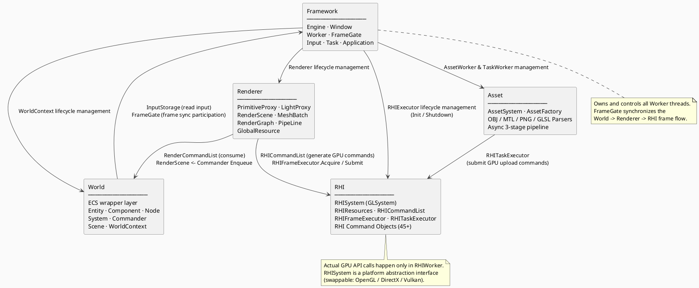

---

### 1. Engine — Full System Composition

The `Engine` class owns and initializes all workers (threads) and subsystems. `FrameGate` synchronizes the frame flow in World → Renderer → RHI order.

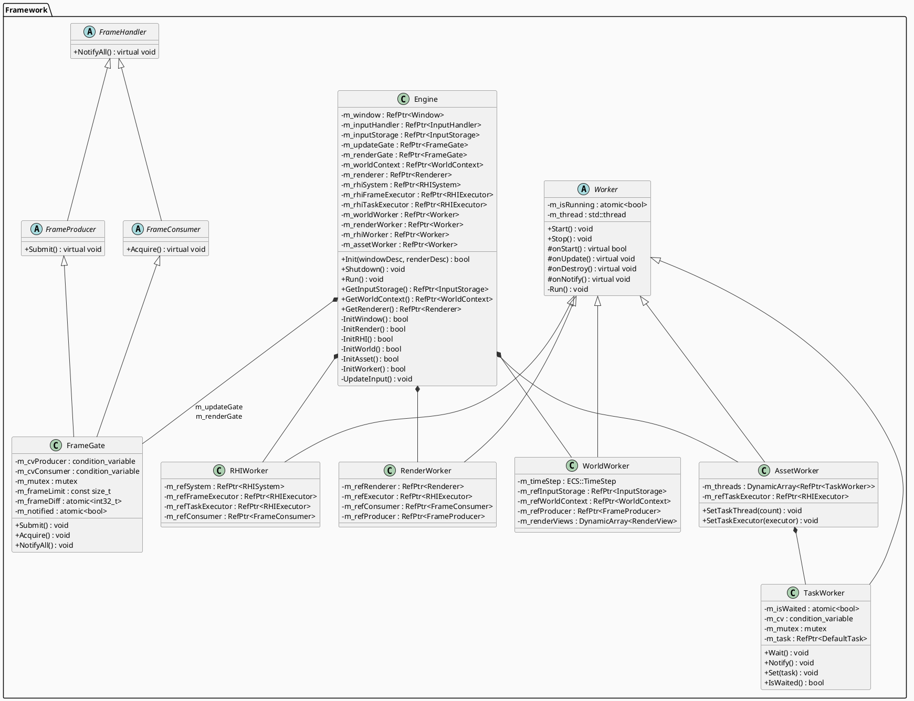

---

### 2. World — ECS Game Logic Layer

References Unreal Engine's `UWorld`, `AActor`, `UActorComponent` structure. `Entity` acts as the `Actor`, `Component` holds data, and `Node` handles component composition. `Commander` is the one-way data bridge from World → Renderer.

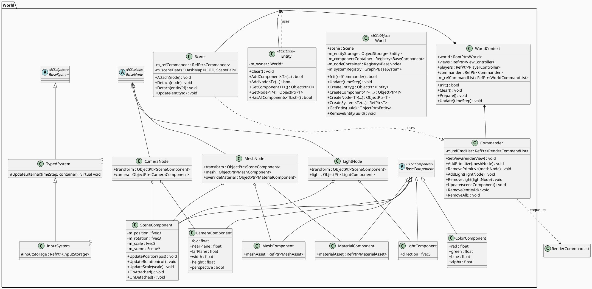

---

### 3. Renderer — Rendering Abstraction Layer

References Unreal Engine's `FScene`, `FPrimitiveSceneProxy`, `FMeshBatch`, and `FRenderingCompositePassContext`. World objects are never passed directly to the renderer — they are converted into **Proxy** objects. `RenderScene` reorganizes these Proxies into `MeshBatch` instances to implement instancing.

```plantuml
@startuml Renderer_ClassDiagram

skinparam classAttributeIconSize 0
skinparam BackgroundColor #FAFAFA

package "Renderer" {

    class Renderer {
        - m_refScene : RefPtr<RenderScene>
        - m_refGraph : RefPtr<RenderGraph>
        - m_refCommandList : RefPtr<RenderCommandList>
        - m_renderViews : DynamicArray<RenderView>
        + Init() : bool
        + Execute(cmdList) : void
        + SetView(view) : void
        + PreDraw(cmdList) : void
        + Draw(cmdList) : void
        + PostDraw(cmdList) : void
        + GetScene() : RefPtr<RenderScene>
        + GetGraph() : RefPtr<RenderGraph>
    }

    class RenderScene {
        - m_primitives : HashMap<UUID, RefPtr<PrimitiveProxy>>
        - m_lights : HashMap<UUID, RefPtr<LightProxy>>
        - m_meshBatches : HashMap<MeshBatchKey, RefPtr<MeshBatch>>
        - m_pendingPrimitives : DynamicArray<RefPtr<PrimitiveProxy>>
        + Flush(cmdList) : void
        + UpdateProxy(updateInfo, cmdList) : void
        + AddPrimitive(primitive) : void
        + RemovePrimitive(id, cmdList) : void
        + AddLight(light) : void
        + RemoveLight(id) : void
        + AddBatch(primitive, cmdList) : void
        + UpdateBatch(primitive, cmdList) : void
        + RemoveBatch(primitive, cmdList) : void
        + GetMeshBatch(key) : RefPtr<MeshBatch>
    }

    class RenderGraph <<ECS::Graph<PipeLine>>> {
        - m_addable : HashSet<RefPtr<PipeLine>>
        - m_removable : HashSet<RefPtr<PipeLine>>
        - m_globalResource : RefPtr<GlobalResource>
        - m_drawCommands : DynamicArray<RefPtr<MeshDrawCommand>>
        + Init(cmdList) : bool
        + Execute(cmdList, renderScene, renderView) : void
        + Flush(cmdList) : void
        + Add(pipeline) : void
        + Remove(pipeline) : void
    }

    class GlobalResource {
        + struct CameraData { viewMatrix, projMatrix, cameraPos }
        + struct BufferResource { cameraBuffer }
        + struct TextureResource { position, normal, albedo, depth, stencil }
        + struct ScreenQuadResource { posBuffer, uvBuffer, indexBuffer }
        + Init(cmdList) : bool
        + UpdateCamera(renderView, cmdList) : void
        + GetCameraBuffer() : RefPtr<RHIBuffer>
        + GetScreenQuad() : RefPtr<RHIVertexLayout>
    }

    abstract class PipeLine <<ECS::Object, RenderResource>> {
        - m_pipeLine : RefPtr<RHIPipeLine>
        - m_prepared : bool
        + Execute(commands, globalResource, cmdList) : void
        + Init() : virtual void
        + Prepare() : virtual void
        + Draw(commands, globalResource, cmdList) : virtual void
        + GetShaderState() : virtual eResourceState
    }

    class SimpleColor {
        + Init() : void
        + Prepare() : void
        + Draw(commands, globalResource, cmdList) : void
    }

    class RenderCommandList {
        - m_head : atomic<RenderTask*>
        - m_tail : atomic<RenderTask*>
        - m_allocator[2] : LinearArena
        - m_writeIndex : atomic<size_t>
        - m_readIndex : size_t
        + Enqueue(func) : void
        + ExecuteAll(renderer, cmdList) : void
        + Reset() : void
    }

    class SceneProxy {
        - m_position : fvec3
        - m_rotation : fvec3
        - m_scale : fvec3
        + UpdatePosition(pos) : void
        + UpdateRotation(rot) : void
        + UpdateScale(scale) : void
        + GetTransform() : fmat4
    }

    class PrimitiveProxy {
        - m_refMesh : RefPtr<const MeshAsset>
        - m_refOverrideMaterial : RefPtr<const MaterialAsset>
        + SetMesh(refMesh) : void
        + SetOverrideMaterial(refMaterial) : void
        + GetMesh() : RefPtr<const MeshAsset>
    }

    class LightProxy {
    }

    class MeshBatch {
        - m_transformInfos : HashMap<UUID, TransformInfo>
        - m_transformBuffer : RefPtr<RHIBuffer>
        - m_refDrawCommand : RefPtr<MeshDrawCommand>
        - m_refMesh : RefPtr<const MeshAsset>
        - m_refMaterial : RefPtr<const MaterialAsset>
        - m_sectionIndex : size_t
        + Upload(cmdList) : void
        + Unload(cmdList) : void
        + Sync(cmdList) : void
        + AddTransform(id, transform) : void
        + UpdateTransform(id, transform) : void
        + RemoveTransform(id) : void
        + GetInstanceCount() : size_t
        + GetDrawCommand() : RefPtr<MeshDrawCommand>
    }

    class MeshDrawCommand {
        + vertexLayout : RefPtr<RHIVertexLayout>
        + indexOffset : uint32_t
        + indexCount : uint32_t
        + textureSlots : HashMap<eTextureSlot, RefPtr<RHITexture>>
        + vectorValues : HashMap<eVectorSlot, fvec3>
        + scalarValues : HashMap<eScalarSlot, float>
        + instanceBuffer : RefPtr<RHIBuffer>
        + instanceCount : uint32_t
    }

    class MeshBatchKey {
        + meshId : UUID
        + materialId : UUID
        + meshSection : size_t
        + operator==() : bool
    }

    struct UpdateProxyInfo {
        + id : UUID
        + position : fvec3
        + rotation : fvec3
        + scale : fvec3
    }

    struct RenderView {
        + viewMatrix : fmat4
        + projectionMatrix : fmat4
        + cameraPosition : fvec3
    }
}

Renderer *-- RenderScene
Renderer *-- RenderGraph
Renderer *-- RenderCommandList

RenderGraph *-- GlobalResource
RenderGraph *-- PipeLine

PipeLine <|-- SimpleColor

RenderScene o-- PrimitiveProxy
RenderScene o-- LightProxy
RenderScene o-- MeshBatch

SceneProxy <|-- PrimitiveProxy
SceneProxy <|-- LightProxy

MeshBatch *-- MeshDrawCommand
MeshBatch ..> MeshBatchKey : keyed by

@enduml
```

---

### 4. RHI — Render Hardware Interface

References Unreal Engine's `FRHICommandList`, `FRHIResource`, and `FRHICommandListExecutor` patterns. Abstracts the actual GPU API (OpenGL / DirectX / Vulkan), and all GPU commands are encapsulated as **Command Objects** before being executed serially.

```plantuml
@startuml RHI_ClassDiagram

skinparam classAttributeIconSize 0
skinparam BackgroundColor #FAFAFA

package "RHI" {

    abstract class RHISystem {
        + Init(nativeHandle) : virtual bool
        + Clear(state) : virtual void
        + Flush() : virtual void
        + Present() : virtual void
        + Resize(...) : virtual void
        + SetColorState(state) : virtual void
        + SetDepthState(state) : virtual void
        + SetStencilState(state) : virtual void
        + SetBlendState(state) : virtual void
        + SetRasterizerState(state) : virtual void
        + CreateBuffer(desc) : virtual RefPtr<RHIBuffer>
        + CreateVertexLayout(desc) : virtual RefPtr<RHIVertexLayout>
        + CreateTexture(desc) : virtual RefPtr<RHITexture>
        + CreateSampler(desc) : virtual RefPtr<RHISampler>
        + CreateVertexShader(desc) : virtual RefPtr<RHIShader>
        + CreatePixelShader(desc) : virtual RefPtr<RHIShader>
        + CreatePipeLine(desc) : virtual RefPtr<RHIPipeLine>
        + InitializeBuffer(info, buffer) : virtual void
        + UpdateBuffer(info, buffer) : virtual void
        + DrawIndexPrimitive(info) : virtual void
        + DispatchCompute(info) : virtual void
        ... (40+ methods)
    }

    class GLSystem {
        (OpenGL 4.5 implementation)
    }

    class RHIResource {
        - m_state : atomic<eResourceState>
        + GetRawBuffer() : void*
        + SetState(eState) : void
        + GetState() : eResourceState
    }

    class RHIBuffer {
        - m_desc : RHIBufferDesc
        + GetBufferType() : eBufferType
        + GetAccessType() : eDataAccess
        + GetSize() : uint32_t
        + GetStride() : uint32_t
        + GetCount() : uint32_t
    }

    class RHIVertexLayout {
        - m_desc : RHIVertexLayoutDesc
        + GetNumAttributes() : size_t
    }

    class RHITexture {
        - m_desc : RHITextureDesc
        + GetWidth() : uint32_t
        + GetHeight() : uint32_t
        + GetPixelFormat() : ePixelFormat
        + GetTextureType() : eTextureType
    }

    class RHISampler {
        - m_desc : RHISamplerDesc
        + GetMinFilter() : eFilterMode
        + GetMagFilter() : eFilterMode
    }

    class RHIShader {
        - m_desc : RHIShaderDesc
        + GetShaderType() : eShaderType
    }

    class RHIPipeLine {
        - m_desc : RHIPipeLineDesc
        - m_slots : HashMap<string, RHIResourceBinding>
        + GetClearState() : RHIClearState
        + GetDepthState() : RHIDepthState
        + AddSlot(name, binding) : void
        + HasSlot(name) : bool
        + GetBindingSlot(name) : RHIResourceBinding
    }

    class RHICommandList {
        - m_system : RefPtr<RHISystem>
        - m_commands : DynamicArray<RHICommandBase*>
        - m_frame : size_t
        + Enqueue<T>(...) : void
        + ExecuteAll() : void
        + Reset() : void
        + SetFrame(frame) : void
        + CreateBuffer(info) : RefPtr<RHIBuffer>
        + InitializeBuffer(info, buffer) : void
        + UpdateBuffer(info, buffer) : void
        + DrawIndexPrimitive(info) : void
        ... (delegates to command objects)
    }

    class RHICommandBase {
        - m_func : ExecuteFunc
        + Execute(system) : void
    }

    class "RHICommand<T>" as RHICommandT {
        + ExecuteAndDestruct(system, base) : static void
    }

    note right of RHICommandT
      45+ command classes:
      RHICommandClear
      RHICommandFlush
      RHICommandPresent
      RHICommandInitializeBuffer
      RHICommandUpdateBuffer
      RHICommandInitializeTexture
      RHICommandInitializePipeLine
      RHICommandSetPipeLine
      RHICommandDrawIndexPrimitive
      RHICommandDispatchCompute
      ...
    end note

    abstract class RHIExecutor {
        - m_system : RefPtr<RHISystem>
        + Acquire() : virtual RefPtr<RHICommandList>
        + Submit(cmdList) : virtual void
        + Execute() : virtual void
    }

    class RHIFrameExecutor {
        - m_frameCount : size_t
        - m_recordIndex : size_t
        - m_beginIndex : size_t
        - m_endIndex : atomic<size_t>
        - m_listPool : DynamicArray<RefPtr<RHICommandList>>
        + Acquire() : RefPtr<RHICommandList>
        + Submit(cmdList) : void
        + Execute() : void
        + Init(frameCount) : bool
    }

    class RHITaskExecutor {
        (Command list pool for asset/task uploads)
        + Acquire() : RefPtr<RHICommandList>
        + Submit(cmdList) : void
        + Execute() : void
    }
}

RHISystem <|-- GLSystem

RHIResource <|-- RHIBuffer
RHIResource <|-- RHIVertexLayout
RHIResource <|-- RHITexture
RHIResource <|-- RHISampler
RHIResource <|-- RHIShader
RHIResource <|-- RHIPipeLine

RHICommandBase <|-- RHICommandT

RHICommandList o-- RHICommandBase

RHIExecutor <|-- RHIFrameExecutor
RHIExecutor <|-- RHITaskExecutor

RHICommandList ..> RHISystem : delegates to

@enduml
```

---

### 5. Asset — Async Asset Loading System

Asset loading is organized as a 3-stage pipeline: **Parse (file read)** → **Load (GPU format conversion)** → **Upload (GPU upload)**. Each stage runs in a different thread context, ensuring the main loop is never blocked.

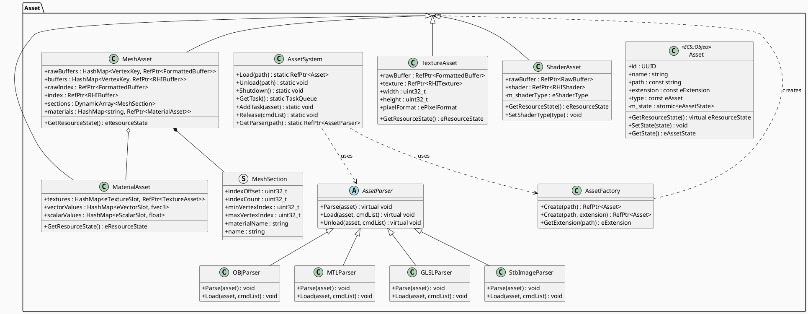

---

## Threading and Data Flow

### Thread Overview

The engine consists of 4 independent worker threads and 1 task thread pool.

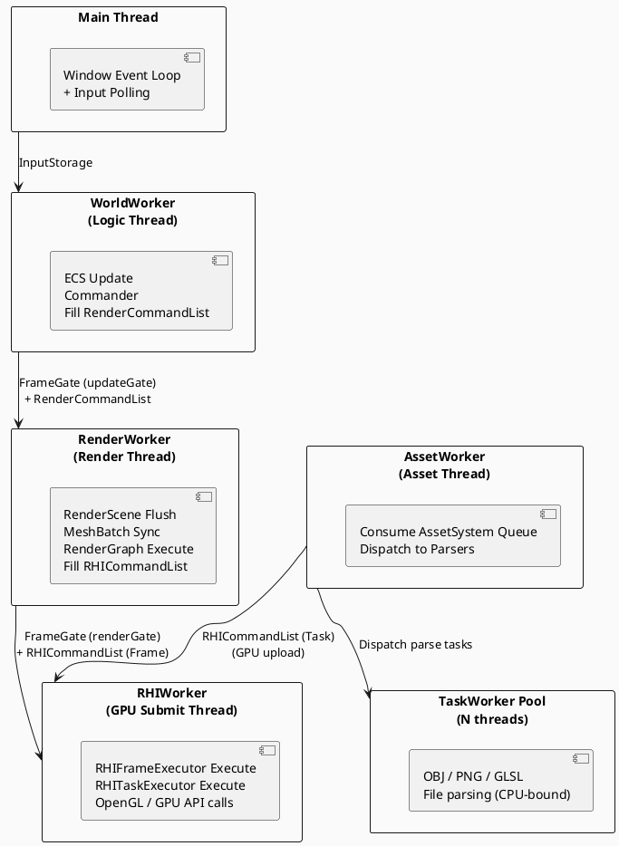

---

### Frame Update Sequence — World → Renderer → RHI

`FrameGate` implements producer-consumer synchronization between World and Renderer, and between Renderer and RHI.

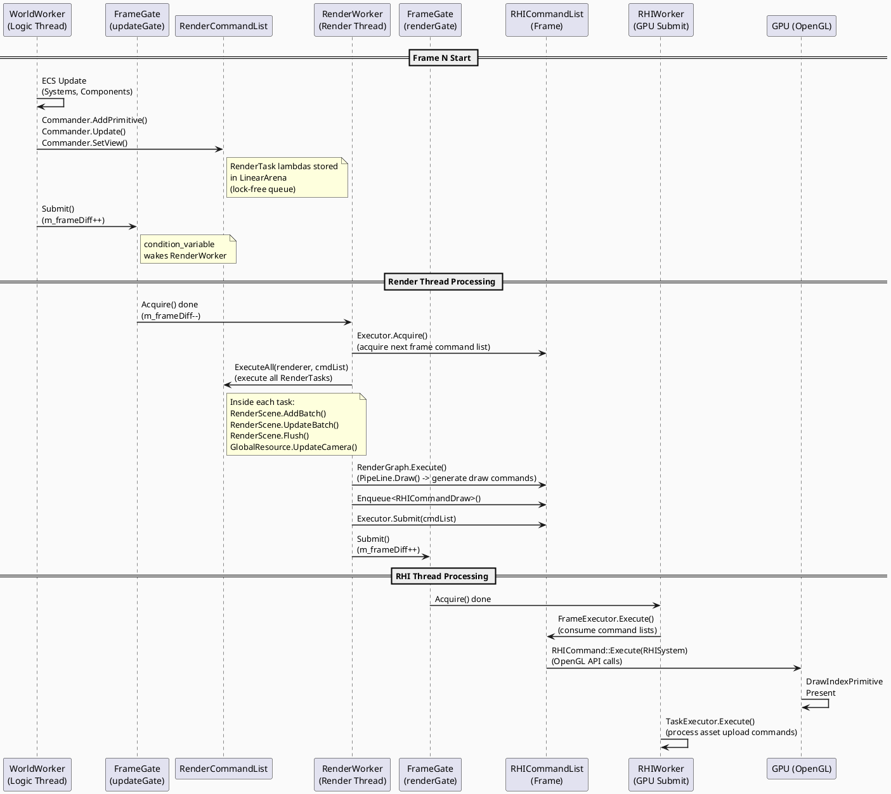

---

### Asset Loading Sequence — Async 3-Stage Pipeline

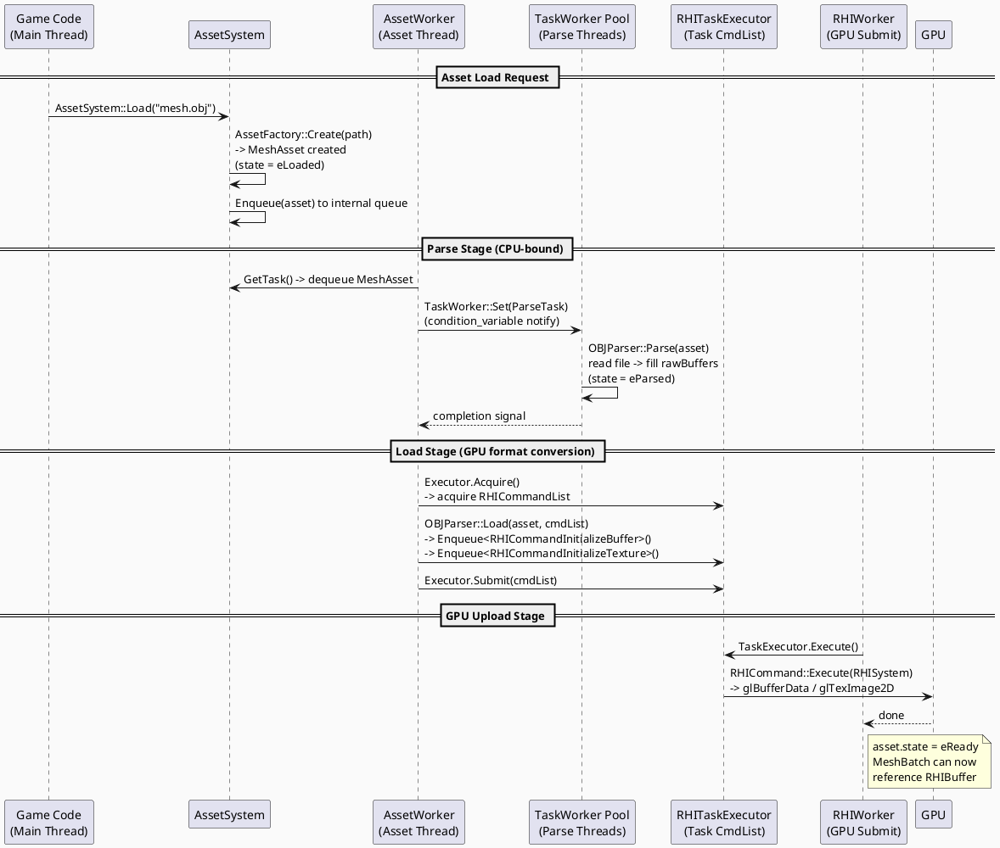

---

### Synchronization Mechanism Detail

```plantuml
@startuml Sync_Detail

skinparam BackgroundColor #FAFAFA

package "FrameGate Internal Structure" {
    class FrameGate {
        - m_cvProducer : condition_variable
        - m_cvConsumer : condition_variable
        - m_mutex : mutex
        - m_frameLimit : const size_t
        - m_frameDiff : atomic<int32_t>
        - m_notified : atomic<bool>
        ..
        Submit() {
          lock(m_mutex)
          m_frameDiff++
          m_cvConsumer.notify_one()
        }
        ..
        Acquire() {
          lock(m_mutex)
          m_cvConsumer.wait(
            lock, [&]{ return m_frameDiff > 0 }
          )
          m_frameDiff--
        }
    }
}

package "RHIFrameExecutor Internal Structure (Triple Buffering)" {
    class RHIFrameExecutor {
        - m_listPool[3] : RHICommandList[]
        - m_recordIndex : size_t   <- written by RenderWorker
        - m_beginIndex : size_t    <- read start index for RHIWorker
        - m_endIndex : atomic      <- cross-thread: Submit writes, Execute reads
        ..
        Acquire() -> returns m_listPool[m_recordIndex]
        Submit()  -> advances m_recordIndex, increments m_endIndex
        Execute() -> processes range m_beginIndex ~ m_endIndex
    }
}

package "RenderCommandList Internal Structure (Lock-free Queue)" {
    class RenderCommandList {
        - m_head : atomic<RenderTask*>
        - m_tail : atomic<RenderTask*>
        - m_allocator[2] : LinearArena  <- ping-pong buffers
        - m_writeIndex : atomic<size_t>
        ..
        Enqueue() {
          task = m_allocator[writeIdx].Alloc()
          CAS(m_tail, task)  <- lock-free insert
        }
        ExecuteAll() {
          m_writeIndex ^= 1  <- swap buffers
          while(head) head->Execute(); head = head->next
        }
    }
}

@enduml
```

---

### Per-Worker Activity Diagrams

Control flow for each Worker during one frame or one task.

#### WorldWorker (Logic Thread)

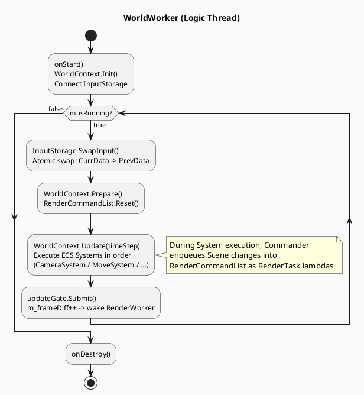

#### RenderWorker (Render Thread)

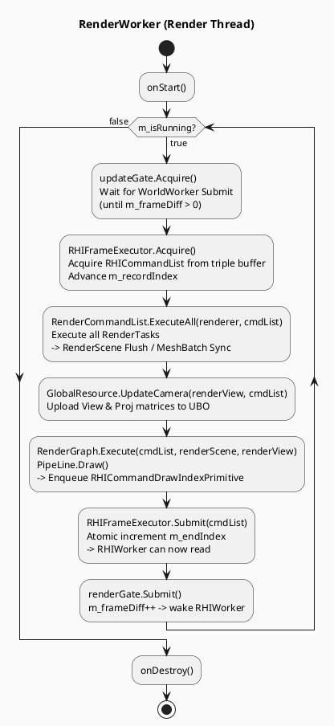

#### RHIWorker (GPU Submit Thread)

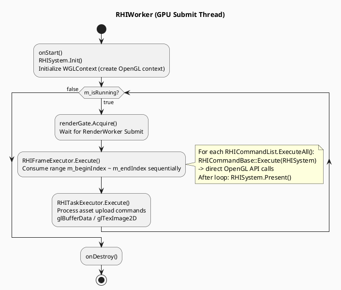

#### AssetWorker (Asset Thread)

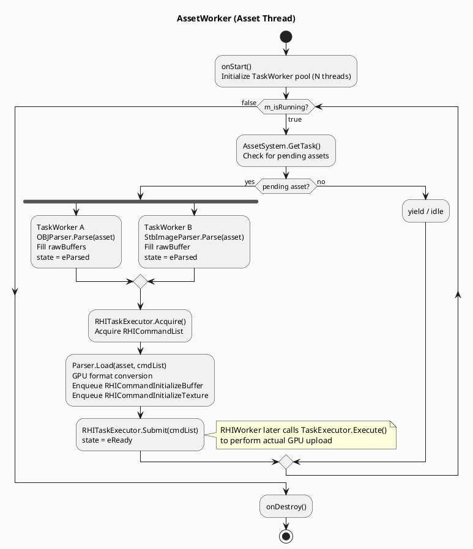

---

## World → Renderer Data Flow Detail

```plantuml
@startuml DataFlow_Detail

skinparam BackgroundColor #FAFAFA

rectangle "World Layer" {
    [Entity] --> [SceneComponent\n(position/rotation/scale)]
    [Entity] --> [MeshComponent\n(MeshAsset ref)]
    [Entity] --> [MaterialComponent\n(MaterialAsset ref)]
    [SceneComponent] --> [Scene]
    [Scene] --> [Commander]
}

rectangle "Bridge Layer" {
    [Commander] --> [RenderCommandList\n(RenderTask lambda queue)]
    note bottom of [RenderCommandList]
      WorldWorker writes (Producer)
      RenderWorker reads (Consumer)
      Zero-alloc via LinearArena ping-pong
    end note
}

rectangle "Renderer Layer" {
    [RenderCommandList] --> [RenderScene]
    [RenderScene] --> [PrimitiveProxy\n(SceneProxy + Mesh/Material)]
    [PrimitiveProxy] --> [MeshBatch\n(grouped by Mesh+Material+Section key)]
    [MeshBatch] --> [MeshDrawCommand\n(VBO, IBO, instance buffer, texture slots)]
    [MeshDrawCommand] --> [RenderGraph]
    [RenderGraph] --> [PipeLine\n(SimpleColor / Deferred planned)]
}

rectangle "RHI Layer" {
    [PipeLine] --> [RHICommandList\n(GPU command object queue)]
    [RHICommandList] --> [RHISystem\n(GLSystem)]
    [RHISystem] --> [GPU\n(OpenGL 4.5)]
}

@enduml
```

---

## Development Process and Technical Challenges

### 1. Multi-threaded Pipeline Design

* **Problem** : Frame data needed to be transferred between World logic updates and GPU rendering without data races
* **Solution** : Two `FrameGate` instances (updateGate, renderGate) handle World→Renderer and Renderer→RHI synchronization independently. `RenderCommandList` uses a lock-free atomic pointer queue with a ping-pong LinearArena, allowing World thread Enqueue and Render thread ExecuteAll to operate safely without locks

### 2. MeshBatch Instancing

* **Problem** : Submitting dozens to hundreds of objects with the same Mesh + Material combination as individual draw calls causes CPU overhead to spike
* **Solution** : A HashMap keyed by `MeshBatchKey (meshId, materialId, sectionIndex)` is maintained in `RenderScene`. Objects with the same key are grouped into a single `MeshBatch`, and transform data is batch-uploaded to the GPU as an instance buffer (`RHIBuffer`)

### 3. RHI Command Object Pattern

* **Problem** : Calling OpenGL APIs directly from the render thread causes `GLContext` thread affinity issues and makes API abstraction impossible
* **Solution** : All GPU commands are encapsulated as `RHICommandBase`-derived objects (45+). RenderWorker only enqueues command objects into `RHICommandList`, and RHIWorker exclusively calls `ExecuteAll()` to perform actual OpenGL calls. `RHIFrameExecutor` uses triple buffering to prevent CPU-GPU pipeline stalls

### 4. PrimitiveProxy Pattern

* **Problem** : Exposing World Entity/Component directly to the renderer creates tight coupling between World and Renderer, hindering independent evolution of both systems
* **Solution** : References Unreal Engine's `UPrimitiveComponent` → `FPrimitiveSceneProxy` pattern. When a `MeshNode` attaches to the Scene, a `PrimitiveProxy` is created. Transform changes are forwarded to the Renderer via `Commander` as `UpdateProxyInfo`. The Renderer has zero knowledge of World types

### 5. Async 3-Stage Asset Pipeline

* **Problem** : Loading large OBJ/PNG files blocks the main loop, and GPU uploads must run exclusively in the RHI thread context
* **Solution** : Separated into 3 stages: Parse (TaskWorker pool, parallel CPU) → Load (AssetWorker, GPU format conversion) → Upload (RHITaskExecutor, GPU upload). `atomic<eAssetState>` tracks state transitions safely, and MeshBatch only references `RHIBuffer` once asset state is `eReady`

### 6. Zero-Allocation Render Command Queue

* **Problem** : Allocating RenderTasks with `new` every frame accumulates heap fragmentation and allocation overhead
* **Solution** : `RenderCommandList` runs two `LinearArena` instances in a ping-pong fashion. The write index is atomically swapped so the Producer (World) writes to one buffer while the Consumer (Renderer) drains the other — a Zero-Alloc design

---

## Implementation Status

| System | Status |
|--------|--------|
| ECS (Entity, Component, Node, System, Graph) | ✅ Complete |
| Memory (Pool/Array allocators, RefPtr/ObjectPtr) | ✅ Complete |
| Runtime Reflection (TypeInfo, PropertyInfo, MethodInfo) | ✅ Complete |
| Container (Vector, HashMap, HashSet) | ✅ Complete |
| RHI Layer (OpenGL 4.5, WGL) | ✅ Basic implementation |
| RHI Command Object pattern | ✅ Complete |
| RHI Triple Buffering (FrameExecutor) | ✅ Complete |
| World / Commander / Scene | ✅ Complete |
| PrimitiveProxy / LightProxy | ✅ Complete |
| MeshBatch instancing | ✅ Complete |
| RenderGraph / PipeLine | ✅ Basic implementation (SimpleColor) |
| GlobalResource (Camera, GBuffer textures) | ✅ Complete |
| Asset System (OBJ/MTL/PNG/GLSL) | ✅ Complete |
| Async Asset loading pipeline | ✅ Complete |
| Multi-threaded Worker + FrameGate | ✅ Complete |
| Deferred Rendering Pipeline | 🚧 Planned |
| GC (Mark & Sweep) full integration | 🚧 In progress |
| DirectX 11 / 12 RHI backend | 🚧 Planned |
| Serialization (Reflection-based JSON/Binary) | 🚧 Planned |
| Physics engine integration | 🚧 Planned |

---

## Build Instructions

### Requirements

* **OS:** Windows 10/11 (64-bit)
* **Compiler:** MSVC (Visual Studio 2019+), C++17
* **Tools:** CMake 3.15+, Git

### Clone and Build

```bash
# Clone with submodules
git clone --recursive https://github.com/YourUsername/GameEngine.git
cd GameEngine

# If cloned without submodules
git submodule update --init --recursive

# CMake build
mkdir build && cd build
cmake ..
cmake --build . --config Release
```

---

## Tech Stack

| Item | Details |
|------|---------|
| Language | C++17 |
| Graphics API | OpenGL 4.5 Core Profile |
| Windowing | WGL (Win32 API) |
| Math | GLM 1.0.1 |
| Build | CMake 3.15+ |
| Platform | Windows 10/11 |

---

## License

This project is distributed under the MIT License.
